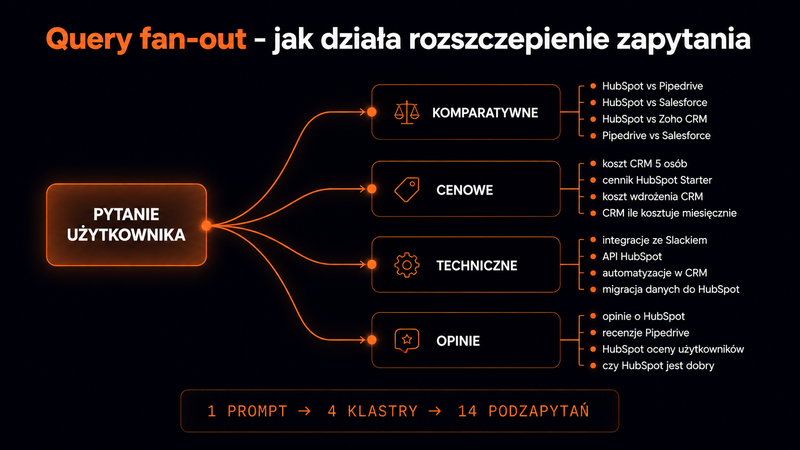

Klasyczne SEO przyzwyczaiło nas do prostego modelu: użytkownik wpisuje frazę, Google dopasowuje strony, my optymalizujemy stronę pod tę frazę. **Query fan-out (rozszczepienie zapytania) wywraca ten model do góry nogami** – pomiędzy pytaniem a odpowiedzią pojawia się warstwa, która rozbija jeden prompt na dziesiątki bardziej szczegółowych podzapytań i dopiero one trafiają do indeksu. Jeśli Twoja strona pasuje do oryginalnej frazy, ale nie odpowiada na żadne z 30 wygenerowanych podzapytań, w odpowiedzi AI po prostu Cię nie ma.

## Czym jest query fan-out

Query fan-out (po polsku: rozszczepienie zapytania) to proces, w którym pojedyncze pytanie użytkownika jest automatycznie rozbijane przez model językowy na wiele bardziej konkretnych podzapytań. Każde z nich trafia osobno do silnika pobierającego dane (klasycznego indeksu Google), który zwraca dla niego pasujące fragmenty. Na końcu model językowy łączy wszystkie wycinki w jedną spójną odpowiedź.

Praktyczny przykład – ktoś pyta Google AI Mode:

> *„Jaki CRM wybrać dla 5-osobowego zespołu sprzedaży B2B SaaS?"*

Model nie szuka stron z tą dokładną frazą. Generuje 20–30 podzapytań w stylu *„najlepsze CRM-y dla małych zespołów"*, *„HubSpot vs Pipedrive cena"*, *„integracje CRM ze Slackiem"*, *„koszt CRM dla startupu"*. Każde z nich ma własną listę wyników. **Twoja strona musi pasować przynajmniej do kilku z nich, żeby zostać uwzględniona w finalnej odpowiedzi.**

## Cztery etapy mechanizmu

Cały proces rozkłada się w sekundach na cztery wyraźne fazy. Każda z nich ma osobne implikacje dla tego, jak powinien być zbudowany Twój content.

| Etap | Co się dzieje | Wpływ na content |
|---|---|---|
| 1. Zrozumienie intencji | Model interpretuje, czego użytkownik naprawdę chce – informacja, porównanie, decyzja zakupowa | Tytuły i wstępy muszą jasno sygnalizować typ treści |
| 2. Generacja podzapytań | Model tworzy 20–40 wariantów, synonimów, podpytań komplementarnych i porównawczych | Trzeba mapować pełen klaster intencji wokół tematu |
| 3. Pobranie fragmentów | Każde podzapytanie idzie osobno do indeksu, system wyciąga konkretne fragmenty, nie całe strony | Struktura tekstu na fragmenty 3-5 zdań, nie ścianki |
| 4. Synteza i cytowanie | Model łączy fragmenty w odpowiedź, lista źródeł obok | Liczy się fragmentaryczna wartość, nie ranking strony jako całości |

W praktyce – Twój blog może być na 50. miejscu w klasycznym Google na frazę główną, ale jeśli ma jeden mocny fragment na podzapytanie *„koszty napraw turbosprężarki Ford"*, ten fragment trafi do odpowiedzi AI Mode. **Optymalizacja przesuwa się z poziomu strony na poziom akapitu.**

## Konkretny przykład rozkładu

Pytanie pozornie proste: *„Czy warto kupować używanego Forda Mondeo z silnikiem Diesla po 2015?"*. Model rozbija je na kilkadziesiąt podzapytań. Część z nich to m.in. –

- najczęstsze usterki Forda Mondeo Diesel po 2015
- żywotność silnika TDCi 2.0 Ford
- problemy z DPF Mondeo
- koszty serwisu Mondeo Diesel po 200 tys. km
- opinie użytkowników Forda Mondeo 2015–2018
- ranking używanych sedanów Diesel 2026
- alternatywy dla Mondeo Diesel
- przebieg powyżej którego nie kupować Mondeo
- normy Euro 6 Mondeo wady
- skrzynia automatyczna PowerShift problemy
- zużycie paliwa Mondeo TDCi w mieście
- ceny używanych Mondeo 2015–2018 w Polsce

I dalsze 10–15 wariantów. Strona, która chce zostać zacytowana w odpowiedzi, nie musi być na pierwszym miejscu w żadnym z tych podzapytań. Wystarczy, że ma kilka fragmentów trafiających do top 5 wyników w 5–8 z nich – wtedy AI uzna ją za źródło wartościowe i prawdopodobnie zacytuje.

<figure class="infographic">
<svg viewBox="0 0 800 480" xmlns="http://www.w3.org/2000/svg" role="img" aria-label="Diagram rozszczepienia jednego pytania użytkownika na 4 grupy podzapytań i 14 konkretnych zapytań szczegółowych"><defs><linearGradient id="fan-line" x1="0" y1="0" x2="1" y2="0"><stop offset="0%" stop-color="#ff6a2e" stop-opacity="0.8"/><stop offset="100%" stop-color="#ff6a2e" stop-opacity="0.15"/></linearGradient></defs><g><rect x="20" y="210" width="180" height="60" rx="10" fill="rgba(255,106,46,0.12)" stroke="#ff6a2e" stroke-width="1.5"/><text x="110" y="236" text-anchor="middle" fill="#e6e7ed" font-family="Inter Tight, system-ui" font-weight="600" font-size="13">Pytanie</text><text x="110" y="254" text-anchor="middle" fill="#9da4b3" font-family="JetBrains Mono, monospace" font-size="10" letter-spacing="0.08em">USER PROMPT</text></g><g font-family="JetBrains Mono, monospace" font-size="10" letter-spacing="0.08em"><line x1="200" y1="240" x2="320" y2="80" stroke="url(#fan-line)" stroke-width="1.5"/><rect x="320" y="60" width="160" height="40" rx="6" fill="#11131f" stroke="#ff6a2e" stroke-opacity="0.4"/><text x="400" y="84" text-anchor="middle" fill="#ff6a2e" font-weight="600">KOMPARATYWNE</text><line x1="200" y1="240" x2="320" y2="180" stroke="url(#fan-line)" stroke-width="1.5"/><rect x="320" y="160" width="160" height="40" rx="6" fill="#11131f" stroke="#ff6a2e" stroke-opacity="0.4"/><text x="400" y="184" text-anchor="middle" fill="#ff6a2e" font-weight="600">CENOWE</text><line x1="200" y1="240" x2="320" y2="280" stroke="url(#fan-line)" stroke-width="1.5"/><rect x="320" y="260" width="160" height="40" rx="6" fill="#11131f" stroke="#ff6a2e" stroke-opacity="0.4"/><text x="400" y="284" text-anchor="middle" fill="#ff6a2e" font-weight="600">TECHNICZNE</text><line x1="200" y1="240" x2="320" y2="380" stroke="url(#fan-line)" stroke-width="1.5"/><rect x="320" y="360" width="160" height="40" rx="6" fill="#11131f" stroke="#ff6a2e" stroke-opacity="0.4"/><text x="400" y="384" text-anchor="middle" fill="#ff6a2e" font-weight="600">OPINIE</text></g><g font-family="Inter, system-ui" font-size="10.5" fill="#cbd0db"><line x1="480" y1="80" x2="560" y2="20" stroke="#3a4055" stroke-width="1"/><line x1="480" y1="80" x2="560" y2="55" stroke="#3a4055" stroke-width="1"/><line x1="480" y1="80" x2="560" y2="90" stroke="#3a4055" stroke-width="1"/><line x1="480" y1="80" x2="560" y2="125" stroke="#3a4055" stroke-width="1"/><text x="565" y="24">HubSpot vs Pipedrive</text><text x="565" y="59">Salesforce vs Notion</text><text x="565" y="94">CRM vs spreadsheet</text><text x="565" y="129">tani zamiennik HubSpot</text><line x1="480" y1="180" x2="560" y2="160" stroke="#3a4055" stroke-width="1"/><line x1="480" y1="180" x2="560" y2="190" stroke="#3a4055" stroke-width="1"/><line x1="480" y1="180" x2="560" y2="220" stroke="#3a4055" stroke-width="1"/><text x="565" y="164">koszt CRM 5 osób</text><text x="565" y="194">CRM darmowy startupy</text><text x="565" y="224">cena per user/mc</text><line x1="480" y1="280" x2="560" y2="255" stroke="#3a4055" stroke-width="1"/><line x1="480" y1="280" x2="560" y2="285" stroke="#3a4055" stroke-width="1"/><line x1="480" y1="280" x2="560" y2="315" stroke="#3a4055" stroke-width="1"/><line x1="480" y1="280" x2="560" y2="345" stroke="#3a4055" stroke-width="1"/><text x="565" y="259">integracje ze Slackiem</text><text x="565" y="289">API dokumentacja</text><text x="565" y="319">migracja z Excela</text><text x="565" y="349">SSO i bezpieczeństwo</text><line x1="480" y1="380" x2="560" y2="365" stroke="#3a4055" stroke-width="1"/><line x1="480" y1="380" x2="560" y2="395" stroke="#3a4055" stroke-width="1"/><line x1="480" y1="380" x2="560" y2="425" stroke="#3a4055" stroke-width="1"/><line x1="480" y1="380" x2="560" y2="455" stroke="#3a4055" stroke-width="1"/><text x="565" y="369">opinie B2B SaaS</text><text x="565" y="399">recenzje G2 4-star</text><text x="565" y="429">case study fintech</text><text x="565" y="459">krzywa nauki team</text></g><text x="400" y="475" text-anchor="middle" fill="#5d6275" font-family="JetBrains Mono, monospace" font-size="9" letter-spacing="0.15em">1 PROMPT → 4 KLASTRY INTENCJI → 14+ PODZAPYTAŃ → 4 LLM × INDEKS</text></svg>
<figcaption>Rozszczepienie jednego pytania o&nbsp;CRM-y na klaster intencji – każde podzapytanie idzie osobno do&nbsp;indeksu, każda strona walczy o&nbsp;swój fragment</figcaption>
</figure>

## Co to znaczy dla SEO i GEO

Trzy fundamentalne zmiany w sposobie projektowania treści –

- **Klastrowe pokrycie zamiast jednej frazy** – dla każdego głównego zapytania komercyjnego zmapuj 20–40 podzapytań, na które AI prawdopodobnie się rozszczepi, i upewnij się, że masz na każde z nich konkretny fragment z odpowiedzią
- **Fragmentaryczna wartość zamiast rankingu strony** – Twój ogólny ranking w Google ma drugorzędne znaczenie. Liczy się to, czy konkretny akapit odpowiada na konkretne podzapytanie, najlepiej w pierwszych 30% tekstu
- **Pokrycie tematyczne ważniejsze od linków** – domena z 30 artykułami w jednej niszy będzie cytowana częściej niż domena z 3 artykułami i 200 backlinkami. AI ufa źródłom, które „wiedzą wszystko" o danym temacie

Badania potwierdzają trzecią zmianę. Kevin Indig przeanalizował 1,2 mln cytowań ChatGPT i wykazał, że [top 10 domen w danej niszy zabiera 46% wszystkich cytowań](https://www.kevin-indig.com/). Reszta domen walczy o resztki.

> **Princeton/KDD 2024 (Aggarwal et al.):** dodanie cytowań źródeł podnosi widoczność w LLM o 30–40%. Keyword stuffing obniża ją o 10% – to akademicka odwrotność klasycznego SEO.

<aside class="callout-fact">
  
✦

  

    
Ciekawostka

    
Query fan-out nie pojawił się dopiero z AI Mode. Mechanizm rozszczepiania zapytania na podpytania był testowany w Google już w MUM (2021) i BERT (2019), ale wówczas wyniki łączono w klasyczną listę 10 niebieskich linków. Dopiero LLM jako warstwa syntezy ujawniła użytkownikowi, że <strong>silniki pobierające od dawna pracują na poziomie fragmentów, nie stron</strong>.

  

</aside>

## Cztery taktyki pod query fan-out

Konkretne działania, które realnie zwiększają szanse na cytowanie. Każda jest niezależna – możesz wdrażać po kolei.

### Mapowanie podzapytań przed pisaniem treści

Zanim napiszesz tekst na temat X, uruchom narzędzie typu `Qforia` (darmowe od iPullRank) lub własny prompt do GPT-4: *„Wygeneruj 30 podzapytań, które Google AI Mode mógłby utworzyć na pytanie [X]"*. Dostaniesz roadmapę H2 i H3 dla artykułu.

Każde podzapytanie powinno mieć swój samowystarczalny fragment z odpowiedzią. Nie wciskaj 30 podzapytań w jeden artykuł – jeśli grupa naturalnie pasuje do osobnego pillara, wydziel ją.

### Wczesne sygnalizowanie kluczowej informacji

Pierwsze 30% tekstu to strefa, w której AI najczęściej szuka cytatów. Indig wykazał, że 44% wszystkich cytowań ChatGPT pochodzi z tej strefy. W praktyce –

- **Zacznij artykuł od konkretu** – definicja, liczba albo wniosek w pierwszych 2-3 zdaniach
- **Nie maskuj odpowiedzi historią branży** – akademicki wstęp odsuwa cytowalny fragment poza strefę 30%
- **Pierwszy akapit po H1 powinien być samowystarczalny** – AI musi móc wyciągnąć go w izolacji

### Strukturyzacja na fragmenty 3-5 zdań

Każdy ważny fakt umieść w samowystarczalnym akapicie z wyraźnym kontekstem. AI nie analizuje całych stron – wybiera pojedyncze wycinki tekstu długości 3–5 zdań. Jeśli Twój fragment mówi *„koszty napraw są wysokie"*, ale wymaga przeczytania trzech wcześniejszych akapitów, żeby zrozumieć kontekst, AI go nie wybierze.

### Format listy i porównań

Listy *„najlepszych X"*, porównania *„marka X vs Y"*, rankingi i FAQ to formaty najlepsze pod query fan-out. Każdy element listy lub para porównawcza tworzy gotowy mini-fragment, który pasuje pod konkretne podzapytanie. Artykuł *„10 najlepszych CRM-ów dla zespołów do 10 osób"* z 10 sekcjami po 200 słów to **10 osobnych fragmentów konkurujących o miejsce w odpowiedzi AI**.

<aside class="callout-expert">
  

  

    
Opinia eksperta

    
Najszybszy efekt w pierwszych 30 dniach po audycie daje refresh trzech najsilniejszych artykułów na blogu klienta – dorzucenie do nich 5–8 H3 odpowiadających na konkretne podzapytania z mapy fan-out. Nie nowy content, nie linkowanie, nie schema. Po prostu dopisanie 800–1200 słów strukturalnie podzielonych na fragmenty. W dwóch projektach SaaS B2B widzieliśmy w ten sposób wzrost cytowań o 40–60% w ciągu 3 tygodni.

    
Mateusz Wiśniewski · SEO Team Leader, ICEA

  

</aside>

## Narzędzia do reverse-engineeringu

Trzy darmowe lub półdarmowe narzędzia, które pokazują, co AI Mode generuje na Twoje główne frazy –

- **Qforia** (iPullRank, darmowe) – wprost zaprojektowane do reverse-engineeringu query fan-out w Google AI Mode. Wpisujesz frazę, dostajesz listę podzapytań, które Google najprawdopodobniej generuje. Najszybsza droga do mapowania struktury artykułu przed pisaniem
- **Google AI Mode** (jako research tool) – sam Google AI Mode jest świetnym narzędziem do testowania własnych zapytań. Wpisz pytanie, kliknij „pokaż więcej źródeł" i analizuj domeny, które AI traktuje jako autorytety w Twojej niszy
- **Perplexity Pro w trybie research** – pokazuje pełną listę zapytań, jakie wykonał silnik wyszukiwania, zanim model językowy złożył odpowiedź. Daje wgląd w logikę rozszczepienia w innym ekosystemie LLM

Logika rozszczepienia opiera się na technologii [embedingów wektorowych](https://pl.wikipedia.org/wiki/S%C5%82owo_zanurzaj%C4%85ce) – wektorowych reprezentacji tekstu, które pozwalają modelowi mierzyć semantyczne podobieństwo między pytaniem a fragmentami w indeksie. To ten sam mechanizm, którego używają systemy rekomendacyjne i wyszukiwarki semantyczne.

## Co query fan-out zmienia w pracy nad treścią

Query fan-out to nie kolejna aktualizacja Google w stylu Panda czy Penguin. To zmiana modelu działania całej warstwy pobierania danych –

- **Z poziomu strony na poziom fragmentu** – AI cytuje akapity, nie URL-e
- **Z jednej frazy na klaster podzapytań** – musisz pokryć cały temat, nie pojedynczą frazę
- **Z linkowania jako sygnału autorytetu na pokrycie tematyczne jako sygnał** – domena ekspercka w niszy wygrywa nad domeną z silnym profilem linkowym

Praktycznie oznacza to, że content tworzony pod klasyczne SEO – długie wprowadzenia, jedna fraza w H1, słabe powiązania z resztą serwisu – będzie tracił widoczność w AI Mode na rzecz krótszych, lepiej podzielonych tekstów, które domykają cały klaster intencji wokół tematu.

W audycie widoczności AI w ICEA jednym z pierwszych elementów jest reverse-engineering query fan-out dla 30–50 priorytetowych pytań w Twojej branży. Wynik to mapa pokrycia – konkretne podzapytania, na które jest już Twoja odpowiedź, te, na które odpowiada konkurencja, i te, których nie obsługuje jeszcze nikt. Te ostatnie to białe plamy do zajęcia jako pierwszy.

Jeśli chcesz zobaczyć, jak Twoja strona wypada w query fan-out dla zapytań Twoich klientów, sprawdź ją darmowym [URL check](/narzedzia/url-check) – analizujemy strukturę fragmentów, wczesne sygnalizowanie kluczowych informacji i pokrycie tematyczne według tych samych zasad, których używa silnik pobierający dane Google.
