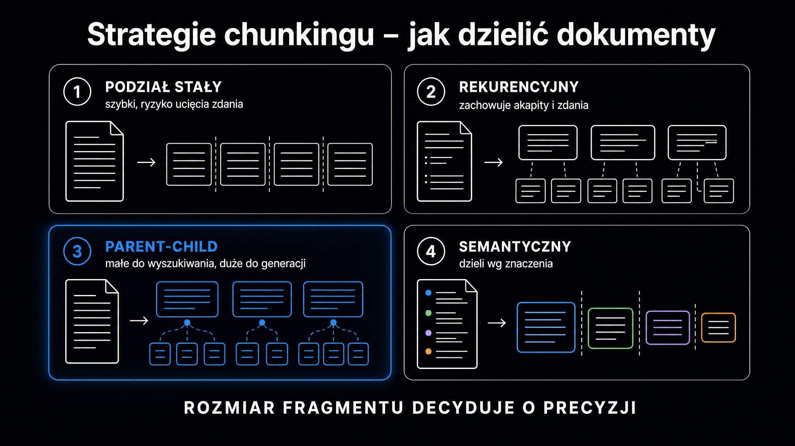

Wybór strategii chunkingu (podziału dokumentów na fragmenty) determinuje jakość całego systemu RAG (ang. *Retrieval-Augmented Generation*, czyli generowania wspomaganego wyszukiwaniem) mocniej niż dobór modelu LLM czy algorytmu wyszukiwania. **Fragment (ang. chunk) to podstawowa jednostka, którą silnik RAG indeksuje i wyszukuje – błędnie wyznaczone granice niszczą kontekst semantyczny, zanim model w ogóle zobaczy dane.** Badanie z arXiv (2603.06976) dowodzi, że prosta segmentacja znakowa osiąga metrykę Precision@1 na poziomie zaledwie 2–3%, podczas gdy metody semantyczne przekraczają 24%. Różnica powstaje na etapie podziału, a nie samego wyszukiwania (retrieval).

## Problem złotego środka – dlaczego rozmiar ma znaczenie

Każdy fragment trafia do modelu osadzającego (ang. *embedding model*), który kompresuje go do wektora o stałej wymiarowości. **Za małe fragmenty – poniżej 100 tokenów – bezpowrotnie izolują fakty od kontekstu, w którym nabierają sensu.** Model LLM dostaje wtedy urywek pozbawiony informacji o tym, kto, kiedy i wobec czego coś stwierdził.

Za duże fragmenty generują odwrotny problem. Gdy do jednego wektora trafia ponad 2000 tokenów o heterogenicznej treści, sygnał semantyczny po prostu się rozmywa – mówimy tu o zjawisku rozmycia semantycznego (ang. *semantic dilution*). Wyszukiwarka zwraca wprawdzie fragmenty tematycznie zbieżne z zapytaniem, ale lokalnie bezużyteczne. Odpowiedź ukrywa się gdzieś w środku, otoczona całkowicie niezwiązanym materiałem.

**Zjawisko „klifu kontekstowego" (ang. *context cliff*) opisane w pracy arXiv:2601.14123 pokazuje gwałtowny spadek wierności odpowiedzi, gdy łączna długość przekazanego kontekstu przekracza ~2500 tokenów.** Modele mają ogromną trudność z selekcją istotnych zdań z przesadnie rozbudowanego okna.

Praktyczny punkt startowy dla większości projektów wynosi 256–512 tokenów z nakładką (ang. *overlap*) rzędu 10–15%. Dostrajanie do konkretnego korpusu następuje dopiero po uruchomieniu złotego zestawu testowego (patrz: ostatnia sekcja).

## Cztery główne strategie chunkingu

Każda strategia odpowiada zupełnie innym właściwościom dokumentów i wymaganiom systemu. Wybór konkretnej metody zależy bezpośrednio od specyfiki projektu oraz dostępnego budżetu obliczeniowego.

| Strategia | Mechanizm podziału | Najlepsze zastosowanie | Koszt obliczeniowy |
|---|---|---|---|
| Sztywna (stały rozmiar) | Stała liczba tokenów / znaków | Szybkie prototypy, jednorodne dane | Bardzo niski |
| Rekurencyjna (recursive) | Hierarchia separatorów językowych | Artykuły, dokumentacja, proza | Niski |
| Semantyczna | Podobieństwo kosinusowe zdań | Dokumenty o zmiennej strukturze | Średni–wysoki |
| Nadrzędno-podrzędna (parent-context) | Małe fragmenty wyszukiwania + duże fragmenty generacji | Produkcja, dokumenty prawne i medyczne | Średni |

### Sztywna segmentacja – szybka, ale kosztowna semantycznie

Podział o stałym rozmiarze (ang. *fixed-size chunking*) tnie sekwencję tokenów na równe przedziały bez uwzględniania struktury tekstu. Dla modelu `text-embedding-3-small` typowy rozmiar wynosi 512 tokenów, natomiast dla `all-MiniLM-L6-v2` – 256 tokenów.

```python
from langchain_text_splitters import TokenTextSplitter

splitter = TokenTextSplitter(
    chunk_size=512,
    chunk_overlap=50,
    encoding_name="cl100k_base",
)
chunks = splitter.split_text(document)
```

Nakładka (ang. *overlap*) wielkości 50 tokenów skutecznie zmniejsza ryzyko ucięcia zdania na granicy fragmentu. Badanie arXiv:2601.14123 udowadnia jednak, że nakładanie fragmentów nie przynosi mierzalnych korzyści jakościowych w generowaniu odpowiedzi – generuje za to zbędne koszty indeksowania. **Nakładka ma sens wyłącznie jako siatka bezpieczeństwa, a nie jako strategia optymalizacji.**

### Segmentacja rekurencyjna – domyślny wybór dla prozy

Rekurencyjny podział znakowy (ang. *recursive character splitting*) stosuje hierarchiczną listę separatorów. Najpierw próbuje ciąć po podwójnych znakach nowej linii (akapity), następnie po pojedynczych, a na końcu po spacjach. Algorytm dzieli tekst na mniejsze fragmenty dopiero po wyczerpaniu separatorów wyższego rzędu.

```python
from langchain_text_splitters import RecursiveCharacterTextSplitter

splitter = RecursiveCharacterTextSplitter(
    chunk_size=600,
    chunk_overlap=60,
    separators=["\n\n", "\n", ". ", " ", ""],
)
chunks = splitter.split_documents(docs)
```

To zdecydowanie najbardziej elastyczna strategia dla tekstów narracyjnych. **Gdy dokument zawiera nagłówki Markdown, analiza Snowflake wykazuje wzrost precyzji o 5–10% po dodaniu `"\n# "` i `"\n## "` na początku listy separatorów.** Fragment zaczyna się wtedy od nagłówka, co daje modelowi osadzającemu bardzo wyraźny sygnał tematyczny.

### Segmentacja semantyczna – gdy granice tematyczne są ważniejsze niż długość

Podział semantyczny (ang. *semantic chunking*) nie pyta „ile tokenów?", tylko „gdzie zmienia się temat?". Algorytm dzieli dokument na zdania i generuje dla każdego reprezentację wektorową (osadzenie) przez model taki jak `text-embedding-3-small`. Następnie oblicza podobieństwo kosinusowe między sąsiednimi zdaniami. Gdy podobieństwo spada poniżej progu podziału (ang. *breakpoint threshold*), system wyznacza granicę nowego fragmentu.

Trzy metody wyznaczania progu dają zupełnie różne wyniki w zależności od analizowanej domeny.

- **Metoda percentylowa** – granica leży tam, gdzie różnica odległości semantycznej przekracza 95. percentyl rozkładu (stabilna dla jednorodnych dokumentów)
- **Metoda odchylenia standardowego** – próg µ + 3σ świetnie sprawdza się dla dokumentów prawnych i medycznych (wynik ważony 43,56 w benchmarku LangChain Semantic Chunking Arena)
- **Metoda rozstępu ćwiartkowego (IQR)** – skutecznie eliminuje wpływ wartości skrajnych i pozostaje stabilna dla dokumentów mieszanych (e-commerce, ML, historia)

```python
from langchain_experimental.text_splitter import SemanticChunker
from langchain_openai import OpenAIEmbeddings

chunker = SemanticChunker(
    OpenAIEmbeddings(model="text-embedding-3-small"),
    breakpoint_threshold_type="interquartile",  # lub "standard_deviation"
)
chunks = chunker.create_documents([text])
```

Osadzenia (ang. *embeddings*) – reprezentacje wektorowe tekstu – to absolutnie kluczowy element tego procesu. Zrozumienie, czym są [osadzenia słów](https://pl.wikipedia.org/wiki/Osadzanie_s%C5%82%C3%B3w), pomaga trafnie dobrać model. Im lepiej rozróżnia on niuanse domeny, tym precyzyjniejsze stają się granice tematyczne. Dla polskojęzycznych korpusów warto przetestować modele wielojęzyczne (`multilingual-e5-large`) zamiast domyślnych wariantów anglojęzycznych.

### Strategia nadrzędno-podrzędna – kompromis dla produkcji

Podział nadrzędno-podrzędny (ang. *parent-context chunking*) skutecznie rozwiązuje sprzeczność między wyszukiwaniem a generowaniem. W bazie wektorowej indeksowane są małe fragmenty podrzędne (ang. *child chunks*, np. 128–256 tokenów) dla precyzyjnego dopasowania semantycznego. Po znalezieniu trafienia system pobiera powiązany fragment nadrzędny (ang. *parent chunk*, np. 1024–2000 tokenów). Trafia on bezpośrednio do kontekstu LLM – od razu z szerokim tłem strukturalnym.

Wyniki badań Stanford University (2025) jednoznacznie potwierdzają przewagę tej metody.

| Metoda | Precyzja | Pełność (Recall) | F1 |
|---|---|---|---|
| Sztywna (512 tokenów) | 0,65 | 0,58 | 0,61 |
| Semantyczna | 0,78 | 0,72 | 0,75 |
| Hierarchiczna | 0,82 | 0,79 | 0,80 |
| Parent-Context | 0,88 | 0,85 | 0,86 |

**Wzrost wartości miary F1 z 0,61 do 0,86 – czyli o 0,25 – to różnica między prototypem a systemem produkcyjnym.** Kosztem jest tu zwiększona złożoność implementacji. Wymaga ona utrzymania mapowania identyfikatorów z fragmentów podrzędnych na nadrzędne oraz obsługi dwupoziomowego magazynu danych.

<aside class="callout-fact">
  <div class="callout-icon">✦</div>
  <div class="callout-body">
    <div class="callout-label">Dane z badań</div>
    <p>Badanie arXiv:2603.06976 porównało metody na długich dokumentach. Grupowanie akapitów (Paragraph Group Chunking) osiągnęło nDCG@5 ≈ 0,459 i Hit@5 ≈ 59%. Prosta segmentacja znakowa (Fixed Character Chunking) – nDCG@5 poniżej 0,244 i Precision@1 rzędu 2–3%. <strong>Ta sama baza wiedzy, inny podział – wynik różni się niemal 10-krotnie.</strong></p>
  </div>
</aside>



## Metadane i wzbogacanie fragmentów

Rozmiar fragmentu to jedno. Drugą kluczową kwestią jest to, co do niego dołączasz. **Wyszukiwanie wzbogacone o metadane (ang. *metadata-enriched retrieval*) osiąga precyzję 82,5% w porównaniu do 73,3% dla wyszukiwania czysto tekstowego (badania IEEE).**

Istnieje kilka kluczowych pól metadanych, które warto dołączyć do każdego fragmentu.

- **`source_url`** – identyfikacja dokumentu źródłowego pozwala filtrować wyniki po domenie lub typie pliku
- **`section_title`** – tytuł sekcji nadrzędnej daje modelowi osadzającemu dodatkowy sygnał tematyczny
- **`chunk_index`** – pozycja fragmentu w dokumencie przydaje się przy rerankowaniu i analizie pozycji odpowiedzi
- **`doc_type`** – typ dokumentu (umowa, artykuł, FAQ, instrukcja) umożliwia sprawny routing do wyspecjalizowanych indeksów

```python
def build_chunk_metadata(doc, chunk_text, chunk_idx, section_title=""):
    return {
        "text": chunk_text,
        "source_url": doc.metadata.get("source", ""),
        "section_title": section_title,
        "chunk_index": chunk_idx,
        "doc_type": doc.metadata.get("type", "unknown"),
        "char_count": len(chunk_text),
    }
```

Firma Snowflake udowodniła, że samo dodanie nagłówków Markdown jako pola metadanych podnosi precyzję o 5–10% względem podziału bez kontekstu sekcji. **Dla systemów SQL wdrożenie zarządzanych metadanych podniosło dokładność generowania zapytań aż o 38%.**

## Dokumenty o złożonej strukturze – PDF-y i tabele

Standardowe metody niszczą dwuwymiarową strukturę tabel, spłaszczając wiersze i kolumny do zwykłego strumienia tekstu. LLM nie ma najmniejszych szans na odtworzenie relacji semantycznych z tak przygotowanego wejścia.

Dla dokumentów silnie ustrukturyzowanych wizualnie – takich jak raporty finansowe, dokumentacja techniczna czy umowy – najlepiej sprawdza się segmentacja na poziomie stron (ang. *page-level chunking*). **W testach porównawczych NVIDIA metoda ta osiągnęła celność 0,648 przy najniższej wariancji wyników.**

W tym procesie obowiązują trzy zasady, których łamanie kosztuje najwięcej.

- **Nie rozdzielaj procedur** – lista kroków lub instrukcja muszą trafić do jednego fragmentu (rozbita lista to gwarantowane halucynacje w kroku 3. lub 4.)
- **Ciągłość wielostronicowa** – tabela lub lista przechodząca między stronami PDF musi zostać scalona przez parser przed podziałem (chunkowaniem)
- **Czyść powtarzalne elementy** – nagłówki stron, stopki i numery generują szum wektorowy, dlatego usuń je już na etapie parsowania

Jak to wygląda w potoku przetwarzania (ang. *pipeline*)? Mechanizm wyszukiwania w systemach RAG decyduje o tym, co ostatecznie trafia do LLM, i jest bezpośrednio zależny od jakości fragmentów. O tym, jak modele następnie selekcjonują te dane do cytowania, piszemy szerzej w artykule o [cytowaniu źródeł przez LLM](/geo/jak-llm-cytuja-zrodla/).

## Architektura potoku i diagnostyka błędów

Wydajny potok akwizycji danych (ang. *ingestion pipeline*) składa się z trzech w pełni monitorowalnych modułów.

```
┌──────────────┐     ┌──────────────┐     ┌──────────────┐
│  Konektory   │ ──> │   Parsery    │ ──> │ Segmentatory │
│  (S3, GDrive)│     │ (PDF→tekst)  │     │  (chunkers)  │
└──────────────┘     └──────────────┘     └──────────────┘
```

**Konektory** pobierają dane z systemów źródłowych i zachowują stabilne identyfikatory obiektów (co zapobiega zjawisku dryfu danych, ang. *data drift*, przy ponownym pobieraniu). **Parsery** tłumaczą pliki binarne (PDF, DOCX) na ustrukturyzowane elementy logiczne. Z kolei **segmentatory** grupują te elementy w ostateczne fragmenty wejściowe.

Istnieją dwa główne sygnały diagnostyczne wskazujące na zbyt agresywne dzielenie tekstu.

- **Skalowanie niszczy precyzję** – system działa poprawnie na 5 GB, ale precyzja gwałtownie spada po rozbudowie do 50 GB (granice fragmentów rozbijają powiązane pojęcia, generując szum przy dużej skali)
- **Reranker drastycznie poprawia retriever** – model rerankujący mocno koryguje wyniki wyszukiwania wektorowego (retrievera), a sam retriever zwraca fragmenty tematycznie zbieżne, ale lokalnie puste (to wyraźny symptom fragmentów za małych lub źle wyznaczonych granic)

Szczegółowo mechanizm rerankowania jako drugi stopień filtrowania opisujemy w artykule o [rerankingu w RAG](/rag/reranking/).

<aside class="callout-expert">
  <div class="callout-icon"></div>
  <div class="callout-body">
    <div class="callout-label">Opinia eksperta</div>
    <p>W projektach RAG, które wdrażaliśmy w ICEA, najczęstszy błąd to kopiowanie parametrów z tutoriali – chunk_size=1000, overlap=200 – bez jakiegokolwiek dostrajania do własnego korpusu. To wartości wzięte z powietrza. Zawsze buduję złoty zbiór testowy: minimum 30 par pytanie → oczekiwana odpowiedź z konkretnego dokumentu. Potem przechodzę przez siatkę parametrów: 256/512/1024 tokenów × 0/10/20% nakładki × trzy strategie. <strong>Bez tej siatki nie ma szans ocenić, która strategia faktycznie działa na Twoich danych – różnica między najgorszym a najlepszym ustawieniem to regularnie 3–5× wyższa precyzja wyszukiwania.</strong></p>
    <div class="callout-author">Michał Ziach · CTO, ICEA</div>
  </div>
</aside>

## Złoty zbiór testowy i ewaluacja

Każda zmiana parametrów segmentacji bez pomiaru to zwykłe zgadywanie. Złoty zbiór testowy (ang. *golden set*) to zestaw par: pytanie → dokument źródłowy → oczekiwany szablon odpowiedzi. **Do wiarygodnych testów potrzebujesz minimum 30–50 par reprezentatywnych dla realnych zapytań użytkowników.**

Warto wziąć pod uwagę trzy osie pomiaru z LlamaIndex Response Evaluation.

- **Wierność (faithfulness)** – czy odpowiedź opiera się wyłącznie na dostarczonym kontekście, czy model zaczyna halucynować
- **Relewancja (relevancy)** – czy odpowiedź jest faktycznie zgodna z intencją pytania
- **Czas odpowiedzi** – rośnie liniowo z rozmiarem fragmentu, co ma krytyczne znaczenie przy umowach SLA

Procedura dostrajania opiera się na kilku krokach.

```python
# Siatka parametrów do przetestowania
param_grid = {
    "chunk_size": [256, 512, 1024],
    "chunk_overlap": [0, 0.1, 0.2],  # jako ułamek chunk_size
    "strategy": ["fixed", "recursive", "semantic"],
}

# Dla każdej kombinacji: ingestuj → zapytaj golden_set → zmierz metryki
# Wybierz konfigurację z najwyższym harmonic mean(faithfulness, relevancy)
```

Po wyborze konfiguracji uruchamiaj testy regresyjne po absolutnie każdej zmianie w potoku (parsery, modele osadzające, schemat metadanych). Każda z tych modyfikacji może przesunąć granice fragmentów na tyle mocno, by drastycznie wpłynąć na wyniki wyszukiwania.

Jeśli budujesz system RAG od podstaw, [przewodnik po RAG](/rag/przewodnik/) opisuje pełną architekturę – od akwizycji danych, przez wyszukiwanie, aż po generację – razem z checklistą gotowości produkcyjnej. Z kolei jakość osadzeń (embeddingów), które stanowią fundament wyszukiwania semantycznego, szczegółowo omawia artykuł o [embeddingach w RAG](/rag/embeddingi/).

Jak Twoje treści wypadają pod kątem podzielności semantycznej? Sprawdź to w praktyce. Narzędzie [Ocena cytowalności strony](/narzedzia/url-check/) analizuje stronę pod kątem struktury i możliwości ekstrakcji fragmentów w zaledwie 30 sekund.
