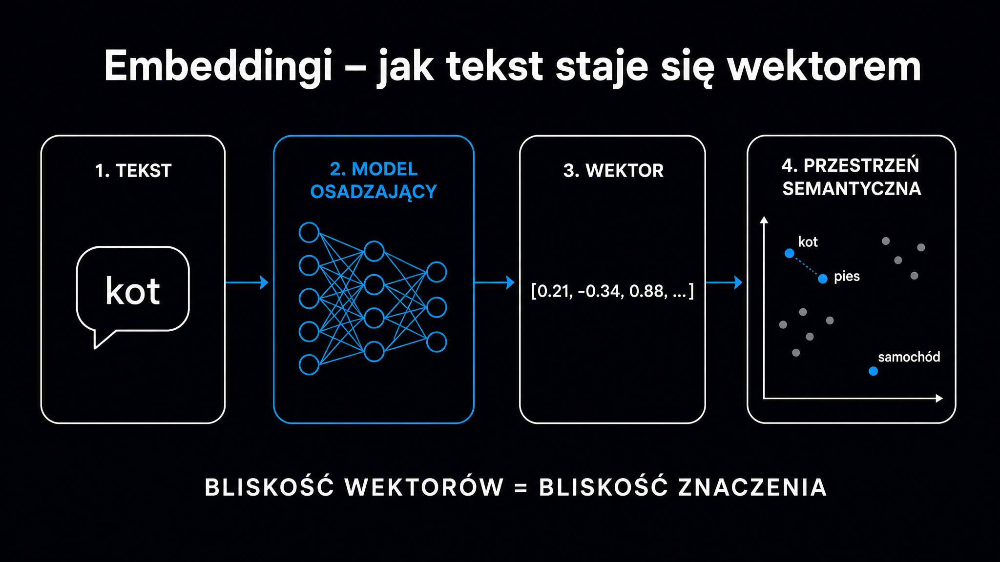

Kiedy system RAG (Retrieval-Augmented Generation, czyli generowanie wspomagane wyszukiwaniem) odpowiada na zapytanie użytkownika, nie przeszukuje tekstu jak klasyczna wyszukiwarka. Zamienia zapytanie oraz każdy fragment dokumentu na ciąg liczb – wektor osadzony (embedding). Następnie szuka wektorów leżących najbliżej siebie w matematycznej przestrzeni. To właśnie ten moment decyduje o być albo nie być Twojej strony w odpowiedzi LLM-a. **Zrozumienie embeddingów nie jest wyłącznie sprawą inżynierów – każdy, kto tworzy treści pod AI Search, powinien wiedzieć, jak komputery mierzą znaczenie.**

## Słowa jako punkty w przestrzeni – czym jest embedding

Tradycyjne przetwarzanie tekstu traktowało każde słowo jako niezależny symbol. „Samochód" i „auto" były dla maszyny równie odległe, co „samochód" i „ziemniak". Brakowało geometrii znaczeń – istniała tylko płaska lista niezwiązanych ze sobą identyfikatorów.

Embeddingi zmieniają tę logikę fundamentalnie. Każde słowo, zdanie lub fragment dokumentu staje się punktem w przestrzeni o setkach lub tysiącach wymiarów. **Słowa o podobnym znaczeniu lądują blisko siebie – odległość geometryczna odpowiada bliskości semantycznej.** „Samochód", „auto" i „pojazd" tworzą sąsiedni klaster. „Ziemniak" leży geometrycznie daleko.

W praktyce embedding to po prostu lista liczb zmiennoprzecinkowych – na przykład `[0.23, -0.87, 0.11, ...]` o długości 768 lub 1536 wartości, zależnie od modelu. Ta technika, znana w literaturze jako [osadzanie słów](https://pl.wikipedia.org/wiki/Word_embedding), stanowi dziś absolutny fundament współczesnego przetwarzania języka naturalnego (NLP).

Najważniejsze pojęcia w kontekście embeddingów to

- **Wektor osadzony (embedding)** – numeryczna reprezentacja tekstu jako punkt w przestrzeni wielowymiarowej
- **Wymiarowość** – liczba współrzędnych wektora, gdzie typowe modele produkcyjne używają 768–3072 wymiarów
- **Podobieństwo kosinusowe** – miara bliskości dwóch wektorów, w której wartość 1,0 oznacza identyczne kierunki, a 0,0 brak związku
- **Przestrzeń wektorowa** – matematyczny świat, w którym żyją wszystkie embeddingi danego modelu
- **Model embeddingowy** – sieć neuronowa zamieniająca tekst na wektory, której popularne przykłady to `text-embedding-3-large` od OpenAI czy modele z rodziny E5

## Skąd model wie, co znaczy słowo?

Inżynierowie nie programują modeli embeddingowych ręcznie. Nikt nie przypisuje każdemu słowu gotowej listy liczb. Systemy te uczą się znaczeń z danych – z miliardów zdań pobranych z internetu, książek i artykułów.

U podstaw tego procesu leży hipoteza dystrybucyjna. **Wyrazy, które regularnie pojawiają się w podobnych kontekstach, mają podobne znaczenie.** „Premier" i „prezydent" rzadko stoją obok siebie, ale oba często występują w sąsiedztwie słów „rząd", „wybory", „decyzja". Model wychwytuje te wzorce i umieszcza oba pojęcia blisko siebie w przestrzeni wektorowej.

Wczesne modele, takie jak Word2Vec z 2013 roku, przypisywały każdemu słowu jeden stały wektor niezależnie od kontekstu. Rodziło to problem polisemii. Słowo „zamek" dostawało jeden punkt w przestrzeni, który musiał jednocześnie reprezentować twierdzę, zamek błyskawiczny i blokadę w drzwiach. Semantyczny sygnał po prostu się rozmywał.

Architektura Transformer, wprowadzona przez zespół Google w 2017 roku, skutecznie rozwiązała ten problem. Mechanizm samouwagi (self-attention) pozwala modelowi generować inny wektor dla tego samego słowa w zależności od całego otaczającego zdania. „Zamek" w tekście o średniowieczu dostaje inny embedding niż „zamek" w opisie kurtki. **To kontekstowe osadzanie stanowi fundament modeli takich jak BERT i GPT.** Właśnie dlatego nowoczesne systemy RAG potrafią rozumieć pytania sformułowane naturalnym językiem, a nie tylko dopasowywać słowa kluczowe.

### Zdania i dokumenty – embedding nie tylko dla słów

Systemy RAG nie operują na poziomie pojedynczych słów. Potrzebują wektorów dla całych fragmentów tekstu – zazwyczaj paragrafów o długości 200–400 słów. Model embeddingowy zamienia cały taki blok na jeden punkt w przestrzeni reprezentujący jego zbiorowe znaczenie.

Tu pojawia się praktyczna pułapka. Jeśli fragment obejmuje zbyt wiele tematów naraz, jego wektor ulega uśrednieniu i nie reprezentuje żadnego zagadnienia wystarczająco mocno. Dlatego przemyślana strategia segmentacji tekstu (ang. chunking, czyli dzielenie dokumentu na fragmenty) odgrywa tak kluczową rolę – o czym szczegółowo traktuje artykuł o [strategiach podziału dokumentów](/rag/chunking-strategie/).

## Jak RAG używa embeddingów do wyszukiwania?

Kiedy użytkownik wpisuje pytanie w ChatGPT lub Perplexity, system RAG uruchamia określoną sekwencję kroków

1. Model embeddingowy zamienia zapytanie użytkownika na wektor, używając tego samego algorytmu co przy indeksowaniu dokumentów.
2. Baza wektorowa (np. Pinecone, Weaviate lub pgvector) przeszukuje swój indeks i zwraca kilkanaście fragmentów o wektorach geometrycznie najbliższych wektorowi zapytania.
3. System przekazuje te fragmenty – jako surowy tekst – do dużego modelu językowego (LLM) razem z oryginalnym pytaniem.
4. LLM generuje ostateczną odpowiedź na bazie dostarczonych materiałów.

**Twoja strona pojawia się w odpowiedzi AI tylko wtedy, gdy jej fragmenty wygrają ten konkurs podobieństwa wektorowego.** Dobry ranking w tradycyjnym Google już nie wystarczy. Musi istnieć ścisła semantyczna bliskość między Twoją treścią a pytaniami faktycznie zadawanymi przez użytkowników.

Pełny obraz mechanizmów pobierania i cytowania treści przez silniki RAG znajdziesz w [przewodniku po systemach RAG](/rag/przewodnik/).

<aside class="callout-fact">
  
✦

  

    
Ciekawostka

    
Modele embeddingowe trenowane techniką kontrastową uczą się, przyciągając do siebie pary semantycznie podobnych tekstów i „odpychając" teksty o różnym znaczeniu. Badania nad modelami z rodziny E5 pokazują, że wstępny trening na setkach milionów par tekstowych, a dopiero potem dostrajanie (<strong>fine-tuning</strong>) na mniejszych, nadzorowanych zbiorach, daje lepsze wyniki niż trening nadzorowany od samego początku. Geometria przestrzeni wektorowej powstaje w dużej mierze automatycznie – ze wzorców w danych, a nie z reguł napisanych przez człowieka.

  

</aside>

## Jak mierzyć bliskość: podobieństwo kosinusowe i inne metryki?

System dysponujący dwoma wektorami – zapytaniem i fragmentem dokumentu – musi obliczyć poziom ich podobieństwa. Najpopularniejszą miarą pozostaje podobieństwo kosinusowe. Zamiast mierzyć odległość między punktami w przestrzeni, algorytm bada kosinus kąta między ich wektorami. Wartość 1,0 oznacza identyczny kierunek (pełna semantyczna zbieżność), 0,0 wskazuje na prostopadłe ustawienie (brak związku), a -1,0 to kierunki przeciwne.

Dlaczego kąt, a nie odległość? Krótki fragment „ChatGPT to model OpenAI" i długi artykuł o ChatGPT mogą wyznaczać ten sam kierunek w przestrzeni, ale leżeć w różnych odległościach od punktu zerowego. Dzieje się tak, ponieważ dłuższy tekst generuje wektor o większej długości. Miara kosinusowa ignoruje ten parametr i porównuje wyłącznie kierunki. Daje to znacznie lepsze wyniki przy tekstach o różnej objętości.

Zestawienie trzech głównych metryk używanych w bazach wektorowych prezentuje się następująco

| Metryka | Co mierzy | Kiedy stosować |
|---|---|---|
| Podobieństwo kosinusowe | Kosinus kąta między wektorami | Wyszukiwanie semantyczne, porównywanie dokumentów różnej długości |
| Iloczyn skalarny | Kąt + długość wektora | Systemy rekomendacji; wymaga znormalizowanych wektorów dla identycznych wyników co podobieństwo kosinusowe |
| Odległość euklidesowa (L2) | Bezwzględna odległość w przestrzeni | Grupowanie (klasteryzacja), detekcja anomalii; wrażliwa na długość wektora |

W praktyce większość systemów RAG używa podobieństwa kosinusowego lub iloczynu skalarnego na wektorach znormalizowanych. Matematycznie dają one wtedy identyczne uszeregowanie wyników, jednak iloczyn skalarny działa szybciej pod kątem obliczeniowym.

## Ograniczenia embeddingów – gdzie semantyka zawodzi

Embeddingi są potężne, ale zdecydowanie nie nieomylne. Kilka systemowych słabości bezpośrednio wpływa na sposób obsługi Twoich treści przez systemy RAG.

**Kontekst rozwiązuje problem polisemii jedynie częściowo.** Zbyt krótkie lub ogólne zdanie może wygenerować wektor uśredniony między kilkoma znaczeniami danego słowa. W efekcie fragment trafia do wyników wyszukiwania dla tematów, z którymi nie ma absolutnie nic wspólnego.

Kolejną pułapką pozostaje sarkazm i ironia. „Uwielbiam stać w korkach" i „Korki są okropne" wyrażają dokładnie to samo, ale model embeddingowy wygeneruje dla nich odmienne wektory. Podobieństwo kosinusowe okaże się niskie mimo identycznej intencji. W treściach marketingowych rzadko stanowi to problem, jednak warto pamiętać o tym ograniczeniu.

Z perspektywy praktyki SEO/GEO znacznie ważniejsza jest trzecia słabość

- **Terminologia wewnętrzna i skróty** – nazwy własne produktów, wewnętrzne kody projektów czy branżowe skróty bez rozwinięcia nie mają ugruntowanej reprezentacji w modelach trenowanych na ogólnym korpusie, przez co wektor skrótu „WCAG 2.2" może leżeć daleko od wektora frazy „dostępność cyfrowa"
- **Odwrócenie relacji logicznej** – „wartość pieniądza w czasie" i „pieniężna wartość czasu" mają bardzo podobne embeddingi (podobieństwo ~0,73), choć to zupełnie różne pojęcia ekonomiczne, a modele oparte wyłącznie na wektorach często mylą je w wynikach
- **Słownictwo specjalistyczne** – teksty z dziedzin słabo reprezentowanych w danych treningowych są embedowane znacznie mniej precyzyjnie niż treści z popularnych nisz

Właśnie dlatego zaawansowane systemy łączą wyszukiwanie wektorowe z klasycznym dopasowaniem słów kluczowych (np. BM25). Takie podejście – znane jako wyszukiwanie hybrydowe – daje o wiele lepsze wyniki niż sama semantyka. Sprawdza się to szczególnie przy zapytaniach z unikalnymi nazwami własnymi. Mechanizm ponownego rangowania (reranking) po wstępnym wyszukiwaniu wektorowym omówimy osobno w artykule o [rerankingu w systemach RAG](/rag/reranking/).

## Co to znaczy dla treści tworzonych pod AI?

Skoro LLM-y cytują fragmenty o wektorach najbliższych wektorowi zapytania, niesie to za sobą bardzo konkretne implikacje dla procesu tworzenia treści.

Każdy fragment Twojego artykułu musi emitować czysty sygnał semantyczny. Akapit poruszający trzy niezwiązane ze sobą tematy wygeneruje rozmyty wektor. W efekcie słabo dopasuje się do każdego z tych zagadnień z osobna. Jeden akapit to jeden temat – ta zasada ma twarde matematyczne uzasadnienie.

**Zawsze rozwijaj specjalistyczną terminologię.** Jeśli użyjesz skrótu bez wyjaśnienia, embedding tego fragmentu prawdopodobnie minie się z zapytaniami sformułowanymi pełnymi słowami. Napisz raz „GEO (Generative Engine Optimization, czyli optymalizacja pod kątem generatywnych silników wyszukiwania)". Dzięki temu model embeddingowy powiąże Twój tekst zarówno z zapytaniami o skrót, jak i o pełną frazę.

Gęstość faktograficzna ma podwójne znaczenie. Liczby, daty i nazwy własne działają jak unikalne sygnały w przestrzeni wektorowej. Fragmenty nasycone takimi informacjami znacznie precyzyjniej trafiają w zapytania o konkretne dane. **Treść ogólnikowa generuje ogólnikowy wektor i błyskawicznie przegrywa z konkretami konkurencji w konkursie podobieństwa.**

Jak sprawdzić gotowość własnych tekstów pod kątem cytowalności w AI? Darmowy [Ocena cytowalności strony](/narzedzia/url-check/) analizuje stronę pod kątem 8 czynników wpływających na widoczność w systemach RAG – w tym struktury semantycznej oraz gęstości faktograficznej.

<aside class="callout-expert">
  

  

    
Opinia eksperta

    
Kiedy buduję potok przetwarzania RAG dla klienta, pierwsza decyzja dotyczy wyboru modelu embeddingowego – i jest ważniejsza niż wybór samego LLM-a do generowania. Zły model embeddingowy oznacza, że nawet najlepsza baza wiedzy będzie zwracać nieodpowiednie fragmenty. Wielokrotnie widziałem systemy, gdzie zmiana modelu embeddingowego z ogólnego na domenowo dostrojony podnosiła trafność odpowiedzi o 30–40% bez żadnych zmian w treści dokumentów. <strong>Geometria przestrzeni wektorowej to fundament systemu RAG – wszystko inne jest nadbudówką.</strong>

    
Michał Ziach · CTO, ICEA

  

</aside>

## Jak LLM-y korzystają z embeddingów wewnętrznie?

Embeddingi w systemach RAG to tylko jedno z zastosowań. Warto wiedzieć, że duże modele językowe używają wektorów osadzonych również wewnętrznie. To właśnie one stanowią bazową reprezentację, na której operuje każda warstwa Transformera.

Kiedy GPT-5 lub Claude przetwarza tekst, na wejściu każdy token (fragment słowa lub znak interpunkcyjny) zamienia się w wektor. Mechanizm samouwagi przekształca te dane przez kolejne warstwy sieci, wzbogacając je o kontekst całego zdania i dokumentu. Na wyjściu każdej warstwy pojawiają się nowe wektory – coraz silniej przetworzone semantycznie. Ostateczna decyzja o wygenerowaniu kolejnego tokena wynika bezpośrednio z tych wewnętrznych reprezentacji.

Oznacza to, że embeddingi służą nie tylko do wyszukiwania podobnych dokumentów. To dosłownie język, w którym modele językowe myślą. **Kiedy tworzysz tekst zrozumiały dla LLM-a, piszesz materiał generujący przejrzyste, jednoznaczne wektory na każdym poziomie przetwarzania.**

Szerszy kontekst decyzyjności LLM-ów w zakresie cytowania i pobierania danych znajdziesz w artykule o [tym, jak LLM-y cytują źródła](/geo/jak-llm-cytuja-zrodla/). Jeśli natomiast chcesz zrozumieć architekturę samych modeli oraz rodzaje wykorzystywanych przez nie embeddingów, [przewodnik po modelach LLM](/modele-llm/przewodnik/) dostarcza kompleksowe zestawienie porównawcze.
