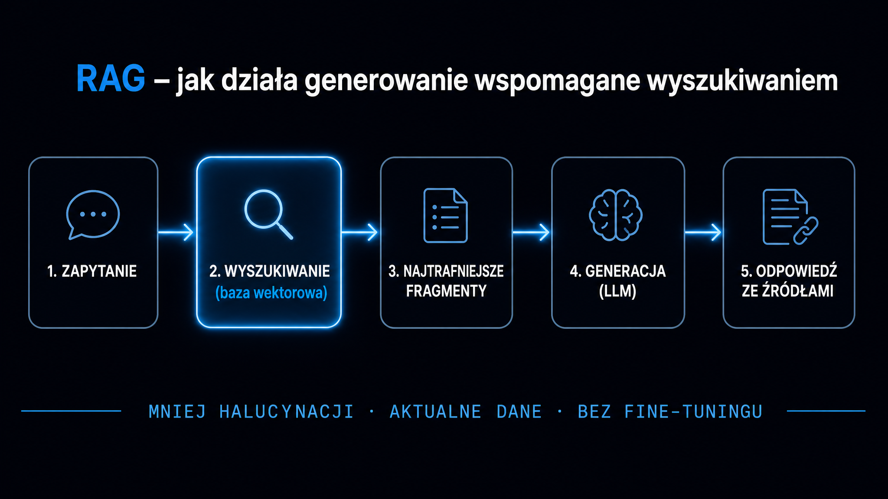

RAG, czyli Retrieval-Augmented Generation (generowanie wspomagane wyszukiwaniem), to architektura, która swoją przewagę nad czystymi modelami językowymi zawdzięcza zasilaniu promptu zewnętrznym kontekstem, pobieranym w czasie rzeczywistym. Zamiast odpowiadać z parametrycznej pamięci wytrenowanego modelu, system RAG najpierw przeczesuje bazę dokumentów, wyciąga najtrafniejsze fragmenty i dopiero wtedy generuje odpowiedź. Efekt: drastycznie mniejsza liczba halucynacji, aktualne dane i możliwość oparcia chatbota lub asystenta na wewnętrznej wiedzy firmy – bez kosztownego fine-tuningu. W tym przewodniku przejdziemy przez całą ścieżkę wdrożeniową: od wyboru architektury, przez strategię segmentacji dokumentów, optymalizację warstwy [reprezentacji wektorowych (embeddingów)](/rag/embeddingi), po ewaluację i bezpieczeństwo systemu produkcyjnego.

## Cztery generacje architektury RAG

Systemy RAG nie są monolitem. Przez ostatnie dwa lata przeszły ewolucję, osiągając kolejne poziomy dojrzałości, a wybór punktu wejścia zależy od wymagań produktowych i budżetu obliczeniowego.

Pierwsza generacja – Naive RAG – to liniowy przepływ: zapytanie użytkownika → reprezentacja wektorowa (embedding) → wyszukiwanie na podstawie podobieństwa kosinusowego w bazie → konkatenacja fragmentów → generacja. Koszt wdrożenia jest niski, a czas do stworzenia prototypu liczony w dniach. Odbywa się to jednak kosztem niskiej precyzji wyszukiwania i braku jakichkolwiek pętli korekcyjnych. W testach produkcyjnych Naive RAG wypada dobrze tylko w domenach z jednorodną, dobrze ustrukturyzowaną bazą wiedzy.

Advanced RAG dodaje dwa kluczowe etapy. Pre-retrieval – przeformułowanie zapytania, wygenerowanie zapytań pomocniczych, techniki takie jak HyDE (Hypothetical Document Embeddings). Post-retrieval – ponowne ocenianie (reranking) pobranych fragmentów modelem Cross-Encoder oraz pozycjonowanie kontekstu w oknie modelu. **Samo wdrożenie rerankingu Cross-Encoder podnosi poprawność odpowiedzi z 33,5% do 49,0% przy dodatkowym opóźnieniu rzędu 120 ms** – to jeden z najlepszych stosunków efektu do kosztu w całej inżynierii RAG. Szczegóły strategii rerankingu opisuje odrębny artykuł o [rerankingu](/rag/reranking).

Modular RAG to architektura kompozytowa, w której każdy komponent – retriever, generator, moduł trasowania – jest wymienialny bez przebudowy reszty systemu. Obejmuje zaawansowane pętle sprzężenia zwrotnego, aktywne uczenie oraz wieloagentowe trasowanie zapytań zależnie od ich złożoności. Złożoność inżynieryjna jest wysoka, ale elastyczność w zamian – niezrównana.

Na czele najnowszych rozwiązań stoi Adaptive RAG z TARG (Training-free Adaptive Retrieval Gating) – bramkowanie decyduje o konieczności uruchomienia wyszukiwania na podstawie analizy opóźnień modelu bazowego, bez konieczności trenowania dodatkowej warstwy. W scenariuszach o dużej skali pojawia się też Sparse RAG – rzadka selekcja kontekstu optymalizująca balans jakości do kosztu obliczeniowego.

Poniższa tabela porównuje cztery poziomy dojrzałości w wymiarach kluczowych dla decyzji architektonicznych:

| Wymiar | Naive RAG | Advanced RAG | Modular RAG | Adaptive RAG |
|---|---|---|---|---|
| Złożoność wdrożenia | Niska (1–2 dni) | Średnia do wysokiej | Wysoka | Bardzo wysoka |
| Mechanizm wyszukiwania | Jednoprzebiegowe wektorowe | Hybrydowe + reranking | Wymienne potoki | Bramkowanie (TARG) |
| Pętle korekcyjne | Brak | Ocena i korekta zapytań | Aktywne uczenie | Autorefleksja (Self-RAG) |
| Opóźnienie | Minimalne | +ok. 120 ms | Zmienne | Dynamicznie optymalizowane |

### Kiedy sięgać po Naive, a kiedy po Advanced

Naive RAG wystarcza, gdy dokumenty są jednorodne, pytania proste i nie trzeba odpowiadać na złożone zapytania wieloetapowe. Chatbot wsparcia oparty na dokumentacji produktu to dobry przykład. Gdy baza wiedzy rośnie powyżej kilkudziesięciu tysięcy fragmentów, a zapytania stają się złożone – Advanced RAG z rerankingiem i wyszukiwaniem hybrydowym staje się koniecznością.

## Strategia segmentacji dokumentów (chunking)

Jakość całego systemu RAG zaczyna się od segmentacji. Modele osadzające mają twarde limity sekwencji wejściowych – przekroczenie maksymalnej długości oznacza bezpowrotne obcięcie tekstu i utratę informacji. Dobór strategii podziału przesądza o tym, czy system znajduje precyzyjne fakty, czy traci kontekst narracyjny.

Wyniki testów porównawczych są jednoznaczne: zmniejszenie rozmiaru fragmentu z 1024 do 64 tokenów podnosi współczynnik czułości (recall@1) o 10–15 punktów procentowych na zbiorach bogatych w encje, bo pojedynczy wektor reprezentuje węższy, bardziej skoncentrowany koncept. Odbywa się to jednak kosztem zdolności do obsługi zapytań wymagających syntezy szerszego kontekstu. To klasyczny dylemat precyzji i pokrycia.

Najefektywniejsze strategie dla systemów produkcyjnych:

- **Podział stały (fixed-size chunking)** – deterministyczny i szybki, niesie ryzyko przecinania zdań w połowie myśli; dobry punkt wyjścia dla jednorodnej dokumentacji
- **Rekurencyjny podział tekstu** – hierarchicznie stosuje separatory (akapity, zdania, słowa), zachowuje spójność gramatyczną; Recursive Split osiąga 69% dokładności generowania i Page F1 = 0,92
- **Segmentacja Parent-Child** – małe fragmenty potomne (128–256 tokenów) do precyzyjnego wyszukiwania wektorowego, duże fragmenty nadrzędne (512–1024 tokenów) przekazywane do generatora; najlepszy balans precyzji i kontekstu
- **Pseudo-Instruction Chunking (PIC)** – podsumowanie na poziomie dokumentu wyznacza granice segmentów bez generowania narzutu kosztowego pełnych wywołań LLM; w testach porównawczych hits@5 = 58,4 (wyższe niż fixed-size 54,5 i semantic chunking 56,0)
- **Segmentacja semantyczna** – grupuje zdania na podstawie odległości kosinusowej osadzeń; optymalizuje spójność granic, ale prowadzi do drastycznej fragmentacji (średnio 43 tokeny w tekstach akademickich) i załamania skuteczności wyszukiwania na poziomie dokumentu (F1 = 0,42)

**Segmentacja semantyczna wygląda elegancko w teorii, ale w praktyce jest pułapką.** W produkcji preferuj Recursive Split lub Parent-Child.

Szczegółową analizę strategii segmentacji, w tym dobór rozmiaru fragmentu do typu dokumentu, opisuje artykuł o [strategiach chunkingu](/rag/chunking-strategie).

### Formuła adaptacyjnego budżetu tokenów

Gdy wiesz, ile tokenów może trafić do generatora, liczbę pobieranych fragmentów wyliczasz ze wzoru:

```
k = round(Docelowa liczba tokenów / Średni rozmiar fragmentu w tokenach)
```

Dla budżetu 2048 tokenów i średniego fragmentu 512 tokenów: k = 4. To prosta kalkulacja, która zapobiega przepełnieniu okna kontekstowego lub jego niedowykorzystaniu.



## Embeddingi – fundament warstwy wyszukiwania

Wybór modelu osadzającego to jedna z najważniejszych decyzji w całym projekcie. Wektor (embedding) to numeryczna reprezentacja fragmentu tekstu w przestrzeni wielowymiarowej – bliskość wektorów odpowiada bliskości semantycznej. Jakość tych reprezentacji bezpośrednio determinuje, czy system znajdzie właściwy fragment.

[Generowanie wspomagane wyszukiwaniem](https://pl.wikipedia.org/wiki/Retrieval-augmented_generation) polega na tym, że zarówno zapytanie, jak i wszystkie fragmenty bazy wiedzy są zamieniane na wektory przez ten sam model osadzający, a wyszukiwanie przebiega w tej samej przestrzeni wektorowej. Różne modele osadzające tworzą różne przestrzenie – fragment indeksowany jednym modelem musi być odpytywany tym samym modelem.

Benchmark MTEB (Massive Text Embedding Benchmark) to dziś standard porównania modeli osadzających. Liderem z wynikiem 70,6 jest Qwen3-Embedding-8B (open-source, wymaga GPU klasy NVIDIA A100). Dla wdrożeń chmurowych dobry stosunek jakości do ceny oferuje Google Gemini Embedding (ok. $0,15–$0,20 za milion tokenów) lub OpenAI text-embedding-3-small (zaledwie $0,02 za milion tokenów). W środowiskach wielojęzycznych i z dokumentami PDF Cohere Embed v4 jako jedyny na rynku obsługuje osadzanie multimodalne (tekst i obrazy bezpośrednio z PDF) plus kompresję binarną dającą 90% oszczędności pamięci.

Na uwagę zasługuje fakt, że OpenAI text-embedding-3-large obsługuje technikę Matryoshka Representation Learning – redukcję wymiarowości wektora z 3072 do 256 przy stracie dokładności zaledwie 2–3%, co drastycznie obniża koszty przechowywania w bazie.

### Bazy wektorowe – pgvector kontra wyspecjalizowane systemy

Powszechne przekonanie o wyższości wyspecjalizowanych baz wektorowych nad systemami relacyjnymi zakwestionowały wyniki rozszerzenia pgvectorscale dla PostgreSQL. **W testach na zbiorze 50 milionów wektorów pgvectorscale osiąga 471 zapytań na sekundę przy 99% czułości, podczas gdy Qdrant w tych samych warunkach daje zaledwie 41 QPS.** Do tego dochodzi pełna spójność transakcyjna ACID i brak narzutu synchronizacji z bazą aplikacyjną.

Dla systemów o masowym wolumenie i rozproszonej architekturze pozostają Milvus (akceleracja GPU) i Pinecone (w pełni zarządzane skalowanie bezserwerowe z multi-tenancy). Qdrant wyróżnia się znakomitym filtrowaniem po metadanych – przydatnym, gdy dokumenty różnią się typem lub uprawnieniami dostępu.

## Optymalizacja wyszukiwania – pre- i post-retrieval

Samo wyszukiwanie wektorowe to punkt wyjścia, nie punkt docelowy. Dwie warstwy optymalizacji – pre-retrieval i post-retrieval – łącznie podnoszą trafność o 30–50%.

Na etapie pre-retrieval najskuteczniejsza technika to HyDE (Hypothetical Document Embeddings). Zamiast zamieniać zapytanie użytkownika w wektor, model LLM najpierw generuje hipotetyczną odpowiedź, a wyszukiwanie odbywa się na jej wektorze. To dopasowanie semantyczne oparte na „kształcie" odpowiedzi, a nie pytania. W testach na zbiorze DL-19 podniosło wskaźnik nDCG@10 z 44,5 (baseline) do 61,3. Technika RQ-RAG z kolei dynamicznie przepisuje, dekomponuje i uściśla zapytania – jest szczególnie przydatna dla złożonych zapytań wieloetapowych.

**Wyszukiwanie hybrydowe – połączenie wyszukiwania semantycznego (wektorów gęstych) z opartym na słowach kluczowych (BM25 lub SPLADE) – poprawia wyniki o 10–20% w domenach specjalistycznych.** Żadna z metod osobno nie pokrywa obu przypadków: wyszukiwanie semantyczne gubi precyzyjne terminy techniczne, a BM25 nie rozumie synonimów.

W fazie post-retrieval centralne miejsce zajmuje Cross-Encoder Reranking, opisany wyżej. Uzupełniają go:

- **LongContextReorder** – algorytm pozycjonujący najistotniejsze fragmenty na obrzeżach okna kontekstowego, eliminując zjawisko „Lost in the Middle" (kiedy model ignoruje informacje w środkowej części długiego promptu)
- **MMR (Maximal Marginal Relevance)** – balansuje trafność pobranych fragmentów z ich wzajemną odmiennością; parametr λ = 0,5 daje optymalny balans i zapobiega zwracaniu *k* identycznych fragmentów z tego samego akapitu
- **LLMLingua** – kompresja kontekstu przez usuwanie zbędnych tokenów; zmniejsza rozmiar promptu bez istotnej straty informacji

### Inżynieria promptu dla RAG

Format promptu wejściowego determinuje jakość generacji. Dla modeli takich jak Claude zalecana jest hierarchia znaczników XML – tworzą one twarde granice semantyczne i eliminują ryzyko zanieczyszczenia instrukcji danymi. Wzorzec: wszystkie pobrane dokumenty owinięte w `<documents>`, a każdy fragment osobno w `<document index="n">`.

Dla dokumentów powyżej 20 000 tokenów kluczowe jest pozycjonowanie: kontekst na górze promptu, zapytanie na samym dole. Przeniesienie zapytania na koniec podnosi jakość odpowiedzi o blisko 30% w złożonych zadaniach wielodokumentowych.

## Ewaluacja systemu RAG

Bez rzetelnego pomiaru nie wiadomo, czy optymalizacja cokolwiek poprawiła. Ewaluacja systemów RAG opiera się na koncepcji LLM-as-a-Judge: wygenerowane odpowiedzi są dekomponowane na atomowe twierdzenia, które modele NLI (wnioskowania w języku naturalnym) weryfikują względem pobranego kontekstu.

Cztery metryki tworzą standardową triadę RAG plus metrykę trafności:

- **Faithfulness (wierność źródłom)** – liczba twierdzeń w odpowiedzi popartych przez pobrany kontekst / całkowita liczba twierdzeń; cel produkcyjny ≥ 0,9
- **Context Precision@K** – czy istotne fragmenty trafiają na górę listy wyszukiwania; mierzy jakość rankingu retrieval
- **Context Recall** – czy system w ogóle znalazł wszystkie fakty potrzebne do odpowiedzi; niska wartość wskazuje na luki w bazie lub złą strategię segmentacji
- **Answer Relevance** – stopień, w jakim odpowiedź odpowiada na intencję pytania; liczona przez generowanie pytań z odpowiedzi i ich porównanie kosinusowe z oryginałem

Wybór narzędzia ewaluacyjnego ma znaczenie. Benchmark 1460 pytań i 14 600 kontekstów pod identycznym sędzią (GPT-4o) pokazał istotne różnice między frameworkami. **TruLens osiąga wysoki wskaźnik selektywności 4,2:1** – poprawnie odróżnia prawidłowy kontekst od niemal identycznego z podmienionymi encjami. WandB Weave daje najwyższą dokładność w porównaniach parami (ang. pairwise accuracy, 94,4%), ale operuje na binarnej skali. DeepEval mimo dobrych właściwości pozycjonowania (NDCG@5 = 0,923) drastycznie niedoszacowuje poprawnych kontekstów (średnia ocena 0,46 zamiast 0,82–0,91), co wyklucza go z pomiaru bezwzględnej jakości.

<aside class="callout-fact">
  <div class="callout-icon">✦</div>
  <div class="callout-body">
    <div class="callout-label">Dane</div>
    <p>Ewaluacja w trybie ciągłym (po każdym zapytaniu) generuje dodatkowe opóźnienie 200–500 ms i <strong>10-krotnie wyższe koszty API</strong> względem ewaluacji wsadowej. Optymalny wzorzec produkcyjny łączy monitoring wskaźnika Faithfulness w czasie rzeczywistym z głęboką ewaluacją wsadową w cyklach dobowych lub tygodniowych. Prosty overlap check zamiast wywołań LLM przyspiesza wykrywanie halucynacji w środowiskach o wysokiej częstotliwości zapytań.</p>
  </div>
</aside>

### Ciągła integracja ewaluacji

Każda zmiana w promptach systemowych lub strukturze dokumentów powinna wyzwalać automatyczny test regresji z wybranym frameworkiem. Cel: wskaźnik Faithfulness ≥ 0,9 i zgodność sędziów ≥ 80% jako bramka przed wdrożeniem na produkcję. To samo co CI/CD w klasycznym software – tyle że zamiast testów jednostkowych masz testy semantyczne.

## Bezpieczeństwo systemu RAG

Otwarcie interfejsu LLM na dynamiczną bazę dokumentów tworzy nową powierzchnię ataku, której nie ma w klasycznych aplikacjach. Zagrożenia działają na trzech poziomach: zatruwanie danych, manipulacja promptem i wyciek informacji.

Wyniki badań są niepokojące. Ataki BadRAG pokazują, że zmiana zaledwie 0,04% zawartości bazy wiedzy skutkuje 98,2% skutecznością ataku. TrojanRAG osadza backdoory bezpośrednio w wektorach modeli osadzających – omijając tradycyjne filtry. Jeszcze bardziej niepokojące są ataki pośredniego wstrzykiwania promptów (Indirect Prompt Injection): złośliwa instrukcja ukryta w dokumencie pobranym przez retriever przejmuje kontrolę nad modelem bez bezpośredniego dostępu do interfejsu. **Zaledwie 5 złośliwych dokumentów na milion rekordów wystarcza do 90% skuteczności ataku.**

Kluczowa zasada obrony: zabezpieczenia nie mogą działać wyłącznie na poziomie promptów systemowych – zbyt łatwo je ominąć. Twarda kontrola musi być realizowana na poziomie bazy danych:

- **RBAC/ABAC pre-retrieval** – kontrola dostępu oparta na rolach lub atrybutach uruchamiana przed wyszukiwaniem; baza zwraca wyłącznie fragmenty, do których użytkownik ma uprawnienia
- **Row-level security (RLS)** – uprawnienia weryfikowane na poziomie wiersza w bazie wektorowej, zintegrowane z middleware OAuth/JWT
- **Provenance i WORM** – weryfikacja pochodzenia danych, kontrola wersji, zapisy niemodyfikowalne (Write Once, Read Many) jako obrona przed zatruwaniem korpusu
- **Dual attribution logging** – rejestrowanie aktywności zarówno tożsamości użytkownika, jak i wywołującego agenta AI; *canary documents* do wykrywania nieautoryzowanego skanowania bazy
- **SD-RAG (Selective Disclosure RAG)** – dane w postaci chronionego grafu, wyspecjalizowany moduł redagujący anonimizuje wrażliwe fragmenty przed przekazaniem do generatora; podnosi wskaźnik ochrony prywatności o 58%

| Zagrożenie | Mechanizm | Skutki | Obrona |
|---|---|---|---|
| Pośrednie wstrzykiwanie promptów | Złośliwe instrukcje w pobranym dokumencie | Przejęcie modelu, wyciek danych | RBAC/ABAC pre-retrieval, parafrazowanie zapytania |
| Zatruwanie korpusu (BadRAG) | Sfałszowane dokumenty (0,04% bazy) | 98,2% skuteczności ataku | Provenance, WORM, kontrola wersji |
| TrojanRAG | Backdoor w wektorach osadzających | Ominięcie filtrów sanitacyjnych | Walidacja integralności osadzeń |
| Luka autoryzacyjna | Brak filtracji uprawnień w bazie wektorowej | Dostęp do poufnych danych | RLS zintegrowane z OAuth/JWT |

<aside class="callout-expert">
  
  <div class="callout-body">
    <div class="callout-label">Opinia eksperta</div>
    <p>W projektach RAG, które wdrażamy w ICEA, najczęstszy błąd to traktowanie bezpieczeństwa jako etapu następującego po prototypie. Tymczasem kontrola dostępu pre-retrieval musi być zaprojektowana razem ze schematem bazy wektorowej od pierwszego dnia. Wdrażanie mechanizmów RBAC z mocą wsteczną do działającego systemu to zwykle projekt sam w sobie. <strong>Jeśli budujesz RAG na danych firmowych, zacznij od schematu uprawnień, nie od wyboru modelu osadzającego.</strong></p>
    <div class="callout-author">Michał Ziach · CTO, ICEA</div>
  </div>
</aside>

## Wdrożenie krok po kroku – od prototypu do produkcji

Przejście od działającego demo do systemu produkcyjnego klasy enterprise to kilka tygodni ustrukturyzowanej pracy. Poniższy harmonogram oparty jest na faktycznych wdrożeniach w ICEA.

**Tydzień 1–2** to audyt i wybór fundamentów. Zdefiniuj typy dokumentów w bazie, pytania, na które system ma odpowiadać, i wymagania dotyczące opóźnień. Na tej podstawie wybierz strategię segmentacji (Recursive Split lub Parent-Child) i model osadzający. Jeśli masz PostgreSQL w stosie – pgvectorscale to naturalne pierwsze rozwiązanie; nie daj się wciągnąć w porównania z Pinecone bez uprzedniego pomiaru na własnych danych.

**Tydzień 3–4** to zbudowanie Naive RAG z pomiarem bazowym. **Zmierz Faithfulness, Context Recall i Answer Relevance na zbiorze 50–100 pytań z odpowiedziami referencyjnymi, zanim cokolwiek zoptymalizujesz.** Bez punktu odniesienia nie wiesz, co i o ile poprawiłeś.

**Tydzień 5–6:** dodaj wyszukiwanie hybrydowe (BM25 + semantyczne) i reranking Cross-Encoder. Zmierz ponownie. Tutaj zwykle pojawia się skok Faithfulness z okolic 0,6–0,7 do 0,8+.

**Tydzień 7–8:** kontrola dostępu pre-retrieval, logowanie, *canary documents*. Automatyczne testy regresji w CI/CD. Dopiero po tym etapie system jest gotowy na dane produkcyjne. Jeśli budujesz asystenta konwersacyjnego na danych klientów, sprawdź też, jak [RAG wpisuje się w obsługę klienta AI](/ai-w-biznesie/ai-w-obsludze-klienta) – architektura jest identyczna, różni się zestaw pytań i wymagania SLA.

### Porównanie wybranych konfiguracji produkcyjnych

| Konfiguracja | Kiedy wybrać | Główna zaleta | Ograniczenie |
|---|---|---|---|
| Recursive Split + pgvector + Gemini Embedding | Startupy, MVP, aplikacje B2B z PostgreSQL | Niski koszt, szybkie wdrożenie | Wymaga dostrajania rozmiaru fragmentu |
| Parent-Child + Qdrant + Cohere Embed v4 | Wielojęzyczne bazy, dokumenty PDF | Precyzja + kontekst, multimodalność | Wyższy koszt operacyjny |
| Adaptive RAG + pgvectorscale + Qwen3-Embedding-8B | Enterprise, wysokie wymagania jakości | Najwyższa jakość, open-source | Wymaga GPU on-premise |

## Jak RAG wpływa na widoczność marki w AI Search

To pytanie zadają coraz częściej CMO i SEO Managerowie, którzy obserwują, jak ChatGPT, Perplexity i Google AI Overviews odpowiadają na pytania o produkty ich firm. Silniki te w trybie RAG dynamicznie pobierają treści ze stron – i cytują te fragmenty, które najlepiej pasują semantycznie do zapytania.

Zasady cytowalności RAG są identyczne z zasadami GEO (Generative Engine Optimization), czyli optymalizacji pod kątem generatywnych wyszukiwarek: samodzielne bloki tekstu, gęste od danych, z nagłówkami odpowiadającymi na jedno konkretne pytanie. Każda strona na Twojej witrynie jest de facto potencjalnym fragmentem w cudzej bazie RAG. **Strony pisane jako ciągły tekst narracyjny wypadają w wyszukiwaniu semantycznym gorzej niż strony z ustrukturyzowanymi blokami 200–400 słów.**

Żeby sprawdzić, jak Twoje URL-e wypadają pod kątem cytowalności przez systemy RAG, narzędzie [URL check](/narzedzia/url-check) analizuje stronę pod kątem kluczowych czynników semantycznych w 30 sekund. Szerszy obraz widoczności marki w LLM – oparty na zapytaniach do czterech silników AI – daje darmowy [brand check](/narzedzia/brand-check). Pełny kontekst strategii GEO opisuje artykuł o [tym, jak LLM-y cytują źródła](/geo/jak-llm-cytuja-zrodla).
