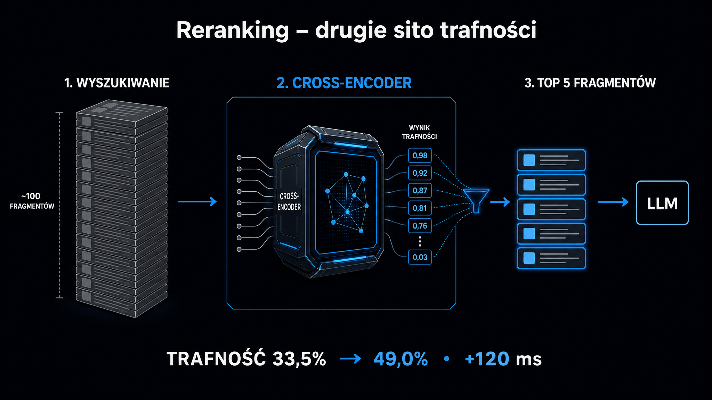

Jeśli Twój system [generowania wspomaganego wyszukiwaniem](https://pl.wikipedia.org/wiki/Retrieval-augmented_generation) (RAG – Retrieval-Augmented Generation) zwraca fragmenty tekstu, które wyglądają sensownie, ale odpowiedzi modelu nadal mijają się z intencją zapytania – problem leży niemal zawsze w tym samym miejscu: brakuje etapu rerankingu (ponownego pozycjonowania wyników). **Testy wdrożeniowe na zbiorach rzędu 3 750 zapytań wykazały, że dodanie cross-encodera jako rerankera stanowiło jeden, najbardziej znaczący krok podnoszący dokładność systemu – wzrost aż o 7,6 punktu procentowego.** Ten artykuł pokazuje, jak architektura dwuetapowa działa w praktyce, czym różnią się bi-encodery od cross-encoderów, kiedy sięgnąć po gotowe API, a kiedy po model lokalny, i jak zmierzyć, czy reranker naprawdę pomaga.

## Dlaczego samo wyszukiwanie wektorowe nie wystarczy?

Klasyczne [RAG](/rag/przewodnik/) opiera wyszukiwanie na bi-encoderach: każdy fragment tekstu jest wstępnie zamieniany na jeden wektor liczbowy (embedding), a w momencie zapytania system szuka wektorów najbardziej zbliżonych do wektora zapytania. To podejście jest szybkie i skalowalne – miliony fragmentów można przeszukać w milisekundy.

Problem polega na tym, że bi-encoder kompresuje cały fragment do jednego wektora o stałej długości. W tej kompresji zatraca się relacja między konkretnymi słowami w zapytaniu a konkretnymi słowami w dokumencie. Przykład z praktyki: zapytanie „tani nocleg" może dostać wysoki wynik podobieństwa dla fragmentu opisującego hotel luksusowy, bo oba teksty mówią o noclegach – a różnica leży w niuansie, którego bi-encoder nie widzi.

Drugim problemem jest zjawisko opisane w literaturze jako „Lost in the Middle" – syndrom gubienia informacji w środku kontekstu. Modele językowe osiągają najwyższą skuteczność, gdy kluczowe informacje leżą na początku lub na końcu podanego kontekstu. Materiał umieszczony w środku długiej listy fragmentów jest często ignorowany lub błędnie interpretowany. **Przekazanie 50 fragmentów pobranych przez bi-encoder wprost do modelu generującego nie dostarcza więcej informacji, lecz generuje więcej szumu.**

### Koszt nieselektywności

Wiele zespołów próbuje obejść ten problem, zwiększając liczbę pobieranych fragmentów. To błąd. Każdy dodatkowy fragment to więcej tokenów w kontekście, wyższy koszt wywołania API i dłuższy czas odpowiedzi. W systemach, które są rozliczane za token, różnica między przekazaniem 5 a 30 fragmentów do modelu to niekiedy dziesięciokrotna różnica w kosztach przy minimalnym wzroście jakości.

Skuteczne wyjście to architektura dwuetapowa, w której etap pierwszy (retrieval) optymalizuje kompletność wyników (recall), a etap drugi (reranking) optymalizuje precyzję (precision). Reranker dostaje wąski zestaw kandydatów – od 20 do 100 fragmentów – i ponownie je porządkuje według głębszego dopasowania do zapytania.

## Bi-encoder, cross-encoder i ColBERT – trzy modele dopasowania

Zrozumienie różnic między architekturami to podstawa świadomego wyboru narzędzia. Każda z nich inaczej oblicza, jak bardzo fragment pasuje do zapytania.

**Bi-encoder** oblicza wektory zapytania i dokumentu niezależnie, a dopasowanie to miara podobieństwa między tymi dwoma wektorami. Zapytanie i dokument nigdy nie wchodzą ze sobą w interakcje na poziomie tokenów. Stąd szybkość, ale i ograniczona precyzja.

**Cross-encoder** (koder krzyżowy) łączy zapytanie i dokument w jedną sekwencję wejściową, zanim przekaże ją do modelu. Mechanizm uwagi (ang. *attention*) może wtedy działać na każdą parę token zapytania × token dokumentu jednocześnie. Model widzi, jak słowo „tani" z zapytania odnosi się do słowa „luksusowy" w dokumencie – i może je rozróżnić. Koszt: cross-encoder jest od 10 do 100 razy wolniejszy niż bi-encoder i nie nadaje się do przeszukiwania milionów dokumentów.

**ColBERT** (Late Interaction – późna interakcja) to kompromis. Zamiast kompresować cały dokument do jednego wektora, generuje osobny wektor dla każdego tokenu. Dopasowanie oblicza się za pomocą operatora MaxSim – dla każdego tokenu w zapytaniu wybiera najwyższe podobieństwo ze wszystkich tokenów dokumentu. Precyzja zbliżona do cross-encodera, możliwość wstępnego obliczenia reprezentacji dokumentów offline – ale za cenę bardzo dużego indeksu wektorowego.

Poniżej zestawienie właściwości, które decydują o wyborze architektury w środowisku produkcyjnym:

| Architektura | Czas wyszukiwania (100 dok.) | Precyzja | Wymagania pamięciowe | Typowe zastosowanie |
|---|---|---|---|---|
| Bi-encoder | Milisekundy | Średnia | Niskie (1 wektor/fragment) | Etap pierwszy – szerokie wyszukiwanie kandydatów |
| Cross-encoder | 50–400 ms | Wysoka | Brak indeksu (obliczenia na żywo) | Etap drugi – precyzyjny reranking |
| ColBERT (Late Interaction) | <100 ms (PLAID) | Wysoka | Ekstremalne (wektory/token) | Wyszukiwanie bez pełnej konkatenacji sekwencji |



## Jak zbudować potok przetwarzania z rerankingiem?

Praktyczna implementacja systemu dwuetapowego wymaga decyzji w trzech obszarach: który model rerankujący wybrać, ile fragmentów przekazać na każdym etapie i jak zintegrować całość z frameworkiem.

### Wybór modelu rerankującego

Modele dzielą się na komercyjne API i rozwiązania lokalne:

- **Cohere Rerank v4.0-pro** – komercyjne API, 32 000 tokenów kontekstu, natywne wsparcie dla JSON i ponad 100 języków; dobry punkt startowy dla prototypów, gdzie czas wdrożenia jest ważniejszy niż koszt jednostkowy
- **BGE-reranker-v2-m3** – model lokalny (568 mln parametrów, Apache 2.0), 512 tokenów, powszechny standard bazowy dla wdrożeń on-premise; wolny i lekki, działa bez GPU
- **Qwen3-Reranker-4B** – wyniki 69,76 na MTEB-R i 81,20 na MTEB-Code; świetna opcja, jeśli indeksujesz dokumentację techniczną lub kod
- **FlashRank** – ultralekki silnik Apache 2.0, zaprojektowany pod środowiska CPU; idealny do wdrożeń brzegowych i mikroserwisów z ograniczoną pamięcią
- **Jina Reranker v3** – tryb listowy (jednoczesna analiza do 64 dokumentów w oknie 131 000 tokenów), wynik 61,94 nDCG@10 na zbiorze BEIR

Do testów wydajnościowych warto sprawdzić [Ocena cytowalności strony](/narzedzia/url-check/) – narzędzie analizuje strukturę strony pod kątem cytowalności, co pomaga ocenić, jak Twoje fragmenty będą się zachowywać w potoku RAG, zanim trafią do modelu.

### Ile fragmentów na każdym etapie?

Sprawdzony wzorzec produkcyjny wygląda następująco: bi-encoder pobiera 30 fragmentów (priorytet: kompletność wyników, nie precyzja), cross-encoder ponownie je porządkuje i zwraca top-5 jako kontekst główny oraz 2–3 kolejne jako rezerwowy. Pozostałe 22–23 fragmenty są odrzucane.

**Kluczowa zasada: unikaj przekazywania do modelu generującego więcej niż 7–8 fragmentów.** Każdy dodatkowy fragment powyżej tej granicy statystycznie obniża jakość odpowiedzi – zjawisko „Lost in the Middle" wkracza niezależnie od długości okna kontekstowego modelu.

### Kaskada dwuprzebiegowa dla dużych zbiorów

Gdy indeks liczy dziesiątki milionów dokumentów lub system musi odpowiedzieć w czasie poniżej 300 ms, jeden reranker może nie wystarczyć. Stosuje się wtedy kaskadę:

1. **Przebieg 1 – szybki filtr**: lekki cross-encoder (MiniLM, Jina v2) redukuje 100 kandydatów do 20 w czasie poniżej 60 ms
2. **Przebieg 2 – głęboka ocena**: cięższy model (BGE-gemma lub dedykowany model oceniający) wybiera top-5 z tych 20 w kolejnych 200 ms

To rozwiązanie zapobiega uruchamianiu dużych modeli na słabo dopasowanych fragmentach.

## Wyszukiwanie hybrydowe i reranker jako spoiwo

Sama wymiana bi-encodera na cross-encoder to połowa optymalizacji. Drugą połowę daje wyszukiwanie hybrydowe (ang. *hybrid search*), które łączy dwa typy wyszukiwania o uzupełniających się właściwościach.

Wyszukiwanie leksykalne i rzadkie reprezentacje wektorowe (algorytm Okapi BM25 lub SPLADE) świetnie radzą sobie z dokładnymi dopasowaniami terminów technicznych, nazw własnych i akronimów. Wyszukiwanie semantyczne (bi-encoder) wychwytuje parafrazy i synonimy. Połączone wyniki z obu systemów trafiają do algorytmu RRF (ang. *Reciprocal Rank Fusion* – fuzja odwrotności rang), który scala listy kandydatów bez konieczności normalizowania skal ocen. Następnie skonsolidowana lista trafia do cross-encodera.

<aside class="callout-fact">
  <div class="callout-icon">✦</div>
  <div class="callout-body">
    <div class="callout-label">Dane z benchmarku</div>
    <p>W testach NVIDIA na potoku pytanie-odpowiedź (QA), model nv-rerankqa-mistral-4b-v3 w połączeniu z NV-EmbedQA-E5-v5 osiągnął średni wskaźnik Recall@5 na poziomie 75,45%. Samo wyszukiwanie wektorowe bez rerankera zatrzymało się na poziomie około 60–65% dla analogicznych konfiguracji. <strong>Różnica 10–15 punktów procentowych to w produkcyjnym systemie biznesowym przepaść między akceptowalną a niedopuszczalną jakością odpowiedzi.</strong></p>
  </div>
</aside>

Reranker doskonale współpracuje też z techniką HyDE (ang. *Hypothetical Document Embeddings*). W ramach tej metody model językowy najpierw generuje hipotetyczną odpowiedź na pytanie, która służy jako wzbogacone zapytanie do bazy wektorowej. Halucynacje w tej hipotetycznej odpowiedzi nie szkodzą – reranker eliminuje błędne założenia HyDE na etapie końcowej selekcji.

Schemat przepływu danych w potoku hybrydowym:

- **BM25 / SPLADE** – dopasowanie słów kluczowych i terminów dokładnych
- **Bi-encoder** – dopasowanie semantyczne przez podobieństwo wektorów
- **RRF Fusion** – scalanie list z obu ścieżek w jedną ujednoliconą listę kandydatów
- **Cross-encoder reranker** – precyzyjne przeszeregowanie według interakcji token po tokenie
- **Selekcja top-5** – kontekst finalny przekazywany do modelu generującego

## Jak mierzyć, czy reranker naprawdę pomaga?

Wdrożenie rerankera bez pomiaru efektów to działanie w ciemno. Trzy metryki, które warto monitorować od pierwszego dnia:

**MRR (ang. *Mean Reciprocal Rank* – średnia odwrotność rang)** ocenia, na jakiej pozycji pojawia się pierwszy trafny dokument. Kluczowa miara dla systemów faktograficznych i asystentów FAQ: jeśli MRR wynosi 0,85, średnio odpowiedź znajdzie się na pierwszej lub drugiej pozycji.

**NDCG@10 (ang. *Normalized Discounted Cumulative Gain*)** to złoty standard oceny dla systemów, gdzie dokumenty mają gradowalną trafność (nie tylko "pasuje / nie pasuje"). Nakłada logarytmiczną karę za umieszczanie wysoce trafnych fragmentów na dalszych pozycjach. Wynik zawsze mieści się w przedziale 0–1, co ułatwia porównywanie konfiguracji.

**IoU (ang. *Intersection-over-Union* – stosunek części wspólnej do sumy)** mierzy, ile tokenów z pobranego fragmentu pokrywa się z tokenami z odpowiedzi wzorcowej. Pozwala wykryć, czy fragmenty są zbyt długie (zawierają szum), czy zbyt krótkie (urywają odpowiedź w połowie).

Praktyczny protokół ewaluacji: przygotuj zestaw 50–100 przykładowych zapytań z oczekiwanymi odpowiedziami wzorcowymi. Zmierz MRR i NDCG@10 bez rerankera (baseline), dodaj reranker i zmierz ponownie. Jeśli MRR wzrósł o mniej niż 5 punktów procentowych, sprawdź strategię podziału dokumentów na fragmenty – problem może leżeć wyżej w potoku.

O tym, jak optymalizować sam podział tekstu, przeczytasz w artykule o [strategiach podziału na fragmenty (chunkingu)](/rag/chunking-strategie/). Jeśli natomiast Twoje embeddingi generują zbyt wiele fałszywych trafień jeszcze przed rerankingiem, warto wrócić do podstaw w artykule o [embeddingach](/rag/embeddingi/).

<aside class="callout-expert">
  <div class="callout-icon"></div>
  <div class="callout-body">
    <div class="callout-label">Opinia eksperta</div>
    <p>W projektach, które realizuję w ICEA, najczęstszy błąd przy wdrożeniu RAG to pomijanie etapu ewaluacji przed wdrożeniem rerankera. Zespół dodaje cross-encoder, system subiektywnie wydaje się lepszy, i na tym kończy się weryfikacja. <strong>Bez zbioru testowego z odpowiedziami wzorcowymi nie wiesz, czy reranker naprawdę poprawia precyzję, czy tylko zmienia kolejność równie słabych fragmentów.</strong> Zanim wybierzesz model rerankujący, zbuduj zestaw 50 zapytań z oczekiwanymi odpowiedziami – to godzina pracy, która może zaoszczędzić tygodnie debugowania.</p>
    <div class="callout-author">Michał Ziach · CTO, ICEA</div>
  </div>
</aside>

## Integracja w LlamaIndex i LangChain

Oba najpopularniejsze frameworki RAG mają gotowe moduły do rerankingu. W LlamaIndex reranker działa jako postprocesor węzłów (`node_postprocessors`). Konfiguracja z Cohere sprowadza się do jednej linii:

```python
cohere_reranker = CohereRerank(api_key=os.getenv("COHERE_API_KEY"), top_n=5)
query_engine = index.as_query_engine(
    retriever=hybrid_retriever,
    node_postprocessors=[cohere_reranker]
)
```

W LangChain odpowiednikiem jest `ContextualCompressionRetriever`, który owija bazowy retriever i aplikuje rerankera jako kompresor semantyczny:

```python
compressor = CohereRerank(model="rerank-english-v3.0", top_n=5)
compression_retriever = ContextualCompressionRetriever(
    base_compressor=compressor,
    base_retriever=base_retriever
)
```

W obu przypadkach `top_n=5` oznacza, że do modelu generującego trafia tylko 5 najlepiej dopasowanych fragmentów. Zmiana tego parametru to najszybszy sposób na manipulowanie kompromisem między precyzją a kompletnością odpowiedzi.

Jeśli chcesz zobaczyć, jak cytowania generowane przez Twój system RAG są postrzegane przez silniki AI, [Widoczność marki w AI](/narzedzia/brand-check/) pokaże aktualną obecność Twojej marki w odpowiedziach czterech głównych modeli – warto traktować to jako zewnętrzny punkt odniesienia dla jakości Twojego systemu.

## Kiedy reranking nie jest odpowiedzią?

Reranker poprawia kolejność kandydatów, ale nie może stworzyć trafnego fragmentu, który nie istnieje w indeksie. Jeśli żaden z 30 pobranych fragmentów nie zawiera odpowiedzi na pytanie – cross-encoder tylko poszereguje złe wyniki w innej kolejności.

Trzy sytuacje, w których problem leży gdzie indziej:

- Niski wskaźnik kompletności (Recall@20 poniżej 60%) – wróć do [strategii podziału na fragmenty](/rag/chunking-strategie/) i długości fragmentów
- Fragmenty trafne, ale odpowiedź wciąż słaba – problem w prompcie lub w modelach generujących, nie w rerankingu
- Reranker poprawia precyzję, ale rosną koszty ponad akceptowalny próg – rozważ lżejszy model w kaskadzie lub model lokalny zamiast API

Jak LLM-y korzystają ze źródeł i jak to wpływa na jakość cytowań, wyjaśnia artykuł o [tym, jak LLM-y cytują źródła](/geo/jak-llm-cytuja-zrodla/) – uzupełniająca perspektywa na całą warstwę między Twoją bazą wiedzy a finalną odpowiedzią.
