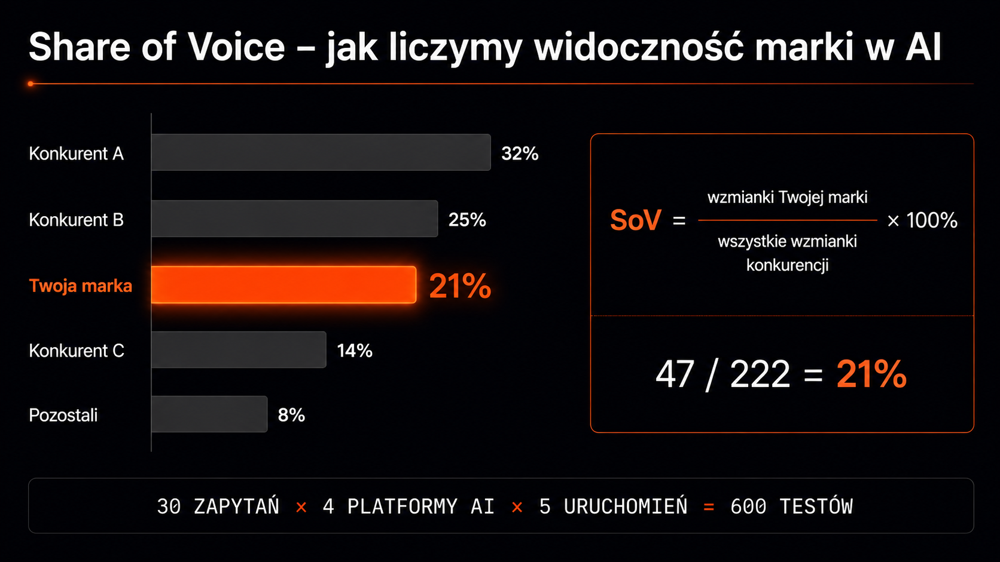

Klient pyta: *„Na której pozycji jesteśmy w ChatGPT?"*. **To pytanie nie ma odpowiedzi** – i dlatego cały biznes klasycznego SEO, od narzędzi do śledzenia rankingu po raporty miesięczne, zaczyna się rozsypywać przy próbie raportowania widoczności w AI. Problem nie polega na tym, że nie potrafimy mierzyć. Problem polega na tym, że ranking jako metryka po prostu przestał istnieć w sensie, w jakim go znamy z klasycznego Google.

## Dlaczego ranking w LLM nie ma sensu

Rand Fishkin (SparkToro) opublikował na początku 2026 roku [badanie](https://sparktoro.com/) na 600 ochotnikach, które powinno być punktem startowym każdej rozmowy o pomiarze widoczności AI. Próba: 2961 testów, 12 zapytań × 3 platformy AI. Wynik:

> **Mniej niż 1% powtarzalności.** Tylko mniej więcej raz na tysiąc uruchomień zobaczysz dwie identyczne listy źródeł w tej samej kolejności.

Powód jest techniczny i wynika wprost z natury LLM-ów. Każdy duży model językowy ma tzw. temperaturę – parametr decydujący o losowości wyboru kolejnych tokenów. Nawet przy temperaturze ustawionej na 0 (deterministycznej w teorii) różnice w przetwarzaniu wsadowym, liczebności próby pobranych fragmentów i kolejności ich wczytywania powodują, że odpowiedzi się różnią. Dodatkowo każde zapytanie uruchamia rozszczepienie zapytania (query fan-out) – generuje kilkadziesiąt podzapytań, których pula też jest niedeterministyczna.

W efekcie sprzedawanie klientowi raportu *„na frazę X jesteśmy na pozycji 3 w ChatGPT"* jest jak sprzedawanie raportu *„dziś było średnio 14 stopni na ulicy"* – formalnie poprawne, praktycznie bezużyteczne. Klient po trzech miesiącach zauważy, że pozycje skaczą losowo, i ma prawo się wkurzyć.

## Trzy metryki, które naprawdę działają

Branża GEO ustaliła trzy metryki probabilistyczne – stabilne na przestrzeni dziesiątek lub setek uruchomień, a nie pojedynczych testów. Razem dają obraz znacznie bliższy temu, co klient naprawdę chce wiedzieć: *„czy ludzie szukający w AI mnie zauważają?"*.

| Metryka | Co liczy | Skąd się bierze | Benchmark dobry wynik |
|---|---|---|---|
| **Share of Voice (SoV)** | % zapytań ze wzmianką marki vs konkurencja | Pula 30 zapytań × 4 platformy × 5 uruchomień | 15–20% w rozdrobnionej niszy |
| **Citation Rate** | % zapytań, w których URL zacytowany jako źródło | Scraping cytowanych URL-i | 12–18% (lider 25%+) |
| **Mention Rate** | % zapytań ze wzmianką marki w tekście (bez URL) | Analiza NLP odpowiedzi LLM | 3–5× wyższy niż Citation Rate dla ugruntowanych marek |

### Share of Voice – relacja, nie liczba absolutna

SoV to procent zapytań, w których Twoja marka pojawiła się w odpowiedzi (z URL lub bez), na tle wszystkich marek konkurencyjnych w tej puli. Bierzesz 30 reprezentatywnych pytań Twoich klientów, każde uruchamiasz w 4 platformach AI po 5 razy, zliczasz wszystkie wzmianki. Twoja marka pojawiła się 47 razy, konkurent A – 78, konkurent B – 62, długi ogon innych – 35 razy. SoV = 47 / 222 = **21%**.

Tę liczbę można porównywać między audytami i zobaczyć trend.

<figure class="infographic">
<svg viewBox="0 0 800 480" xmlns="http://www.w3.org/2000/svg" role="img" aria-label="Wykres Share of Voice – Konkurent A 35,1% (78 wzm.), Konkurent B 27,9% (62 wzm.), Twoja marka 21,2% (47 wzm.), długi ogon 15,8% (35 wzm.); formuła SoV 47÷222=21,2%"><defs><linearGradient id="sov-mute" x1="0" y1="0" x2="1" y2="0"><stop offset="0%" stop-color="#3a4055" stop-opacity="0.7"/><stop offset="100%" stop-color="#3a4055" stop-opacity="0.25"/></linearGradient><linearGradient id="sov-brand" x1="0" y1="0" x2="1" y2="0"><stop offset="0%" stop-color="#ff6a2e" stop-opacity="0.85"/><stop offset="100%" stop-color="#ff6a2e" stop-opacity="0.3"/></linearGradient></defs><text x="20" y="32" fill="#ff6a2e" font-family="JetBrains Mono, monospace" font-size="11" letter-spacing="0.18em" font-weight="600">SHARE OF VOICE</text><text x="20" y="50" fill="#9da4b3" font-family="JetBrains Mono, monospace" font-size="10" letter-spacing="0.08em">30 ZAPYTAŃ × 4 PLATFORMY × 5 URUCHOMIEŃ = 600 TESTÓW</text><g font-family="Inter, system-ui" font-size="13" fill="#cbd0db"><text x="20" y="103">Konkurent A</text><rect x="140" y="88" width="490" height="26" rx="4" fill="url(#sov-mute)" stroke="#3a4055" stroke-width="1"/><text x="640" y="105" fill="#9da4b3" font-family="JetBrains Mono, monospace" font-size="11" letter-spacing="0.05em">35,1% · 78 wzm.</text><text x="20" y="143">Konkurent B</text><rect x="140" y="128" width="389" height="26" rx="4" fill="url(#sov-mute)" stroke="#3a4055" stroke-width="1"/><text x="540" y="145" fill="#9da4b3" font-family="JetBrains Mono, monospace" font-size="11" letter-spacing="0.05em">27,9% · 62 wzm.</text><text x="20" y="183" fill="#ff6a2e" font-family="Inter Tight, system-ui" font-weight="600">Twoja marka</text><rect x="140" y="168" width="296" height="26" rx="4" fill="url(#sov-brand)" stroke="#ff6a2e" stroke-width="1.5"/><text x="446" y="185" fill="#ff6a2e" font-family="JetBrains Mono, monospace" font-size="11" letter-spacing="0.05em" font-weight="600">21,2% · 47 wzm.</text><text x="20" y="223">Długi ogon</text><rect x="140" y="208" width="221" height="26" rx="4" fill="url(#sov-mute)" stroke="#3a4055" stroke-width="1"/><text x="372" y="225" fill="#9da4b3" font-family="JetBrains Mono, monospace" font-size="11" letter-spacing="0.05em">15,8% · 35 wzm.</text></g><line x1="20" y1="260" x2="780" y2="260" stroke="#3a4055" stroke-opacity="0.4" stroke-width="1"/><text x="20" y="290" fill="#5d6275" font-family="JetBrains Mono, monospace" font-size="10" letter-spacing="0.18em">FORMUŁA</text><rect x="20" y="310" width="760" height="100" rx="8" fill="#11131f" stroke="#ff6a2e" stroke-opacity="0.3" stroke-width="1"/><text x="400" y="350" text-anchor="middle" fill="#e6e7ed" font-family="Inter Tight, system-ui" font-size="20" font-weight="600">SoV = wzmianki marki ÷ Σ wszystkich wzmianek</text><text x="400" y="388" text-anchor="middle" fill="#ff6a2e" font-family="JetBrains Mono, monospace" font-size="22" font-weight="600" letter-spacing="0.08em">47 ÷ 222 = 21,2%</text><text x="400" y="455" text-anchor="middle" fill="#5d6275" font-family="JetBrains Mono, monospace" font-size="9" letter-spacing="0.15em">WZMIANKA = MARKA W ODPOWIEDZI AI Z URL LUB BEZ · TREND ZAMIAST POJEDYNCZEGO POMIARU</text></svg>
<figcaption>Pula 600 testów dla 4 marek konkurencyjnych. SoV pokazuje udział marki w widzialności AI – nie pozycję absolutną. Pojedyncza liczba 21,2% nic nie znaczy bez kontekstu konkurencji i&nbsp;trendu kwartalnego.</figcaption>
</figure>

### Citation Rate – mierzy techniczne SEO

Citation Rate różni się od SoV jednym szczegółem: tu liczy się tylko cytowanie z URL, nie sama wzmianka marki w tekście. To metryka stricte technicznego SEO – jeśli rośnie, znaczy, że Twoja strona jest faktycznie indeksowana i wybierana przez silnik pobierający dane.

### Mention Rate – mierzy obecność w danych treningowych

Mention Rate to procent zapytań, w których Twoja marka pojawiła się tylko w tekście odpowiedzi, bez URL. Różnica vs Citation Rate jest znacząca i mówi o dwóch różnych mechanizmach. Wzmianka bez linku wynika z obecności marki w danych treningowych modelu – AI „pamięta", że istniejesz, ale nie wskazuje konkretnego artykułu. Cytat z linkiem oznacza, że konkretna strona została wczytana z indeksu w czasie odpowiedzi.

Britney Muller spuentowała to lapidarnie: *„brand mentions are the new backlinks"*. Wzmianki budujesz przez PR, recenzje, zestawienia *„best of"* i cytowania w mediach – nie przez technical SEO.

<aside class="callout-fact">
  
✦

  

    
Ciekawostka

    
Share of Voice nie powstał w erze AI. Termin wymyśliła agencje reklamowe w latach 60., mierząc <strong>udział marki w nakładach reklamowych całej kategorii</strong>. Później przeszedł do mediów cyfrowych jako udział w zasięgu, w impresjach, w wynikach wyszukiwania. Dziś trafia do GEO – i zaczyna mieć więcej wspólnego z oryginalnym znaczeniem niż jakakolwiek klasyczna metryka SEO.

  

</aside>

## Pięć kroków audytu Share of Voice

W ICEA każdy audyt SoV idzie tym samym schematem. Każdy krok ma konkretny deliverable.

1. **Zdefiniowanie puli zapytań** – wywiad z działem marketingu produktowego, analiza Search Console (które frazy trafiają na konwersje), keyword research i transkrypcje rozmów sprzedażowych. Z tego destylujemy 30–50 reprezentatywnych pytań w naturalnym języku
2. **Zaprojektowanie liczebności próby** – każde pytanie odpalamy minimum 5 razy w każdej z 4 platform (ChatGPT, Claude, Gemini, Perplexity). Dla 30 pytań × 5 uruchomień × 4 platform = 600 testów. To minimum, żeby probabilistyka była stabilna
3. **Scraping i normalizacja danych** – każdą odpowiedź zapisujemy strukturalnie: tekst, lista cytowanych URL-i, lista marek, sentyment. Normalizacja jest kluczowa – „Tesla" w odpowiedzi może odnosić się do firmy lub do Modelu 3, więc używamy NLP do rozróżnienia kontekstu
4. **Porównanie z konkurencją** – SoV bez kontekstu nic nie znaczy. 21% w niszy, gdzie lider ma 28%, to świetnie. 21% w niszy, gdzie lider ma 65%, to katastrofa. Zawsze raportujemy 5 największych konkurentów obok naszej marki
5. **Tracking w czasie** – pojedynczy pomiar to baseline. Realna wartość pojawia się przy trzecim, czwartym pomiarze, kiedy widać trend. Miesięczny re-scan tej samej puli to standard

## Czego unikać przy raportowaniu

Trzy najczęstsze pułapki, w które wpadają agencje próbujące „dorobić" GEO do istniejących raportów SEO:

- **Raportowanie pozycji** – klasyczne narzędzia do śledzenia rankingu zaczęły obiecywać tracking AI Overviews i ChatGPT. To częściowa półprawda – pokazują pojedynczy snapshot, nie probabilistyczną dystrybucję. Klient, który dostaje raport *„na frazę X jesteś w AI Overview na pozycji 2"*, przy następnym sprawdzeniu zobaczy *„nie ma Cię w ogóle"* i nie zrozumie dlaczego
- **Mieszanie SoV z wyświetleniami** – Search Console pokazuje impresje w klasycznym Google. Niektórzy próbują tę metrykę przekładać na AI: *„mamy 10 000 wyświetleń miesięcznie z AI Overviews"*. To liczba, która nie ma znaczenia, dopóki nie zestawisz jej z impresjami konkurencji. SoV to relacja, impresje to liczba absolutna – tylko relacja mówi coś o pozycji konkurencyjnej
- **Ignorowanie Mention Rate** – większość agencji GEO skupia się tylko na Citation Rate, bo to mierzalne za pomocą scrapera. Mention Rate wymaga analizy NLP, więc zostaje pomijany. Tymczasem dla marek B2C i ugruntowanych brandów B2B Mention Rate jest często 3–5× wyższy niż Citation Rate – pomijanie go zafałszowuje obraz

## Jak interpretować wyniki

Pojedynczy SoV 18% nic nie mówi. Interpretacja zależy od trzech zmiennych: branży, charakteru zapytań i kierunku zmiany.

### Branża i konkurencja

W niszach silnie zdominowanych przez 1–2 graczy (Stripe vs PayPal w fintechu, Salesforce vs HubSpot w CRM) SoV poniżej 10% jest realistyczny dla marki pretendującej i nie powinien wywoływać paniki. W rozdrobnionych niszach (agencje SEO, software houses, konsulting) lider często ma SoV w okolicach 15–20%, więc 8% to wynik solidny.

### Charakter zapytań

| Typ pytania | Przykład | Oczekiwany SoV |
|---|---|---|
| Brandowe | *„czy [Twoja marka] dobrze tłumaczy [coś]"* | powyżej 50% (test rozpoznawalności) |
| Komercyjne kategorialne | *„najlepsze CRM 2026"* | 8–20% (kompetycyjność rynku) |
| Definicyjne | *„czym jest GEO"* | 0–5% (autorytet edukacyjny) |

Mieszanie tych typów w jednej liczbie zafałszowuje obraz. **Raportujemy oddzielnie.**

### Kierunek zmiany

Pojedynczy SoV 18% nic nie mówi. Trzy pomiary z trendem 12% → 15% → 18% przez kwartał to twardy dowód, że roadmapa GEO działa. Trzy pomiary 22% → 19% → 16% w tym samym okresie to alarm – konkurencja wdraża coś, czego my nie obsługujemy.

<aside class="callout-expert">
  

  

    
Opinia eksperta

    
Klienci enterprise często chcą jednej liczby – „jaki mamy SoV?". To pułapka. W praktyce u każdego klienta liczymy 3 oddzielne SoV: brandowy, kategorialny i edukacyjny. SoV brandowy wyższy niż 80% to znak, że marka jest rozpoznawalna. SoV kategorialny wyższy niż 15% to znak, że jesteśmy w gronie liderów. SoV edukacyjny wyższy niż 5% to znak, że budujemy autorytet tematyczny. Trzy różne historie, trzy różne plany działania.

    
Tomasz Czechowski · Head of SEO, ICEA

  

</aside>

## Przyszłość raportowania widoczności w AI

Branża SEO przechodzi przez fazę, w której narzędzia istnieją (LLM-y, API, scraping), ale ustalonych standardów raportowania jeszcze nie ma. Każda agencja sprzedająca GEO definiuje własne KPI. Część z nich będzie sensowna i zostanie z nami na lata. Część zniknie, gdy klient zobaczy, że metryki to kosmetyka, nie diagnostyka.

Share of Voice, Citation Rate i Mention Rate – mierzone na rozsądnej liczebności próby, porównywalne z konkurencją, raportowane w trendzie – są dziś najsilniejszą propozycją, jaką może postawić agencja przed klientem. Nie są idealne. Ale są lepsze niż udawanie, że ranking w AI istnieje tak samo jak w klasycznym Google.

W audycie pełnym widoczności AI w ICEA każdy raport zawiera te trzy metryki w trzech ujęciach: Twoja marka, top 5 konkurencji, dynamika kwartalna. Plus szczegółowy podział na platformy – bo SoV w ChatGPT i SoV w Perplexity to różne historie, czasem dramatycznie się różniące. Jeśli chcesz zobaczyć, jak wygląda Twoja marka w tym układzie, zacznij od darmowego [brand check](/narzedzia/brand-check) – w 60 sekund dostaniesz pierwszy snapshot SoV w 4 silnikach AI.
