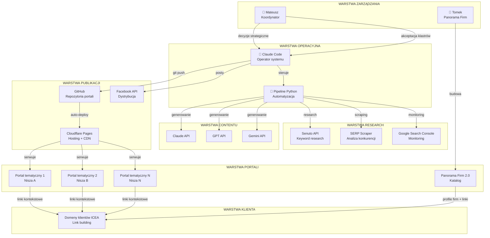
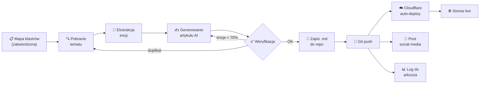
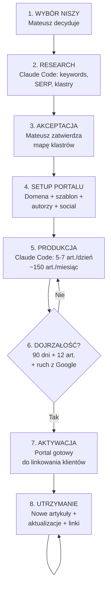
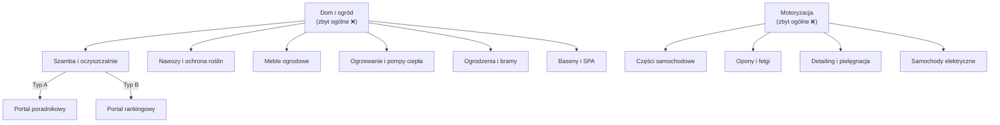
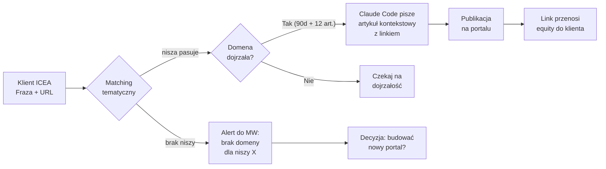

# Propozycja techniczna — nowa sieć BWP 2.0

**Data:** 2026-03-16
**Autor:** Mateusz W. + Claude Code
**Status:** do akceptacji zarządu

---

## 1. Dlaczego nie WordPress?

WordPress to naturalne skojarzenie, kiedy mówimy o stawianiu stron. Ale w naszym przypadku — gdzie celem jest postawienie kilkudziesięciu (docelowo kilkuset) portali tematycznych i zarządzanie nimi w sposób zautomatyzowany — WordPress staje się problemem, a nie rozwiązaniem.

### Koszty utrzymania rosną z każdą domeną

Każda instalacja WordPress to osobny serwer (lub miejsce na serwerze współdzielonym), który wymaga:

- hostingu (50–150 zł/mies. za przyzwoity serwer z dobrym TTFB),
- aktualizacji samego WordPressa, motywu i wtyczek (co tydzień coś wymaga update'u),
- zabezpieczeń — WordPress jest najpopularniejszym CMS-em na świecie, co oznacza, że jest też najczęściej atakowanym. Każda instalacja to potencjalny wektor ataku (brute force, SQL injection, exploity we wtyczkach),
- backupów i monitoringu.

Przy 10 domenach to jeszcze do ogarnięcia. Przy 50 to etat. Przy 200 to koszmar.

**Przeliczenie kosztów hostingu WordPress vs statyczne strony:**

| Skala | WordPress (hosting) | Hugo + Cloudflare Pages |
|---|---|---|
| 10 domen | 500–1 500 zł/mies. | 0 zł |
| 50 domen | 2 500–7 500 zł/mies. | 0 zł |
| 200 domen | 10 000–30 000 zł/mies. | 0 zł* |

*Cloudflare Pages w planie darmowym obsługuje nieograniczoną liczbę domen z nieograniczonym transferem.

### WordPress jest wolny — i trzeba go przyspieszać

Domyślna instalacja WordPress nie spełnia Core Web Vitals. Żeby LCP < 2.5s i CLS < 0.1, trzeba instalować wtyczki cache'ujące, optymalizatory obrazów, CDN-y. To kolejne warstwy złożoności.

Strona statyczna (Hugo) osiąga idealne wyniki Core Web Vitals bez żadnej dodatkowej konfiguracji, bo serwowana jest jako gotowy plik HTML bezpośrednio z CDN-a Cloudflare (ponad 300 punktów obecności na świecie).

### WordPress utrudnia automatyzację

Nasza strategia zakłada, że Claude Code będzie głównym operatorem systemu — pisze artykuły, buduje klastry, publikuje, zarządza strukturą. WordPress wymaga do tego REST API, tokenów autoryzacyjnych, obsługi błędów sieciowych, plug-inów do custom fields. Każdy krok to potencjalny punkt awarii.

W modelu statycznym Claude Code po prostu zapisuje plik Markdown, pushuje do repozytorium Git i strona jest online w ciągu 30 sekund. Żadnych API, żadnych logowań, żadnych wtyczek.

---

## 2. Co to jest Hugo i dlaczego to rozwiązanie?

Hugo to generator stron statycznych (SSG) — narzędzie, które bierze pliki tekstowe (Markdown) i szablony, i generuje z nich gotową stronę HTML.

### Jak to działa w praktyce

```
Piszemy artykuł jako plik tekstowy (.md)
    ↓
Hugo generuje z niego stronę HTML (< 1 sekundy)
    ↓
Pliki trafiają na Cloudflare Pages
    ↓
Strona jest dostępna na całym świecie
```

Nie ma żadnej bazy danych. Nie ma serwera aplikacyjnego. Nie ma PHP. Są tylko pliki HTML, CSS i (opcjonalnie) JavaScript — serwowane bezpośrednio z CDN-a.

### Czy Hugo nie jest przeładowane JavaScriptem?

**Nie. Hugo generuje czyste HTML.** Domyślnie na stronie nie ma ani jednej linijki JavaScriptu — chyba że sami zdecydujemy się coś dodać (np. analytics).

Dla porównania:

| Technologia | JavaScript na stronie | Wpływ na SEO |
|---|---|---|
| WordPress + Elementor | 500 KB – 2 MB JS | Negatywny (wolne ładowanie, opóźniony render) |
| WordPress + lekki motyw | 100–300 KB JS | Neutralny |
| Hugo (domyślnie) | **0 KB JS** | **Pozytywny** (natychmiastowy render) |
| Astro | 0 KB JS (domyślnie, JS opcjonalny per komponent) | Pozytywny |

Hugo jest szybszy niż Astro w generowaniu stron (tysiące stron w sekundy vs minuty), prostszy w konfiguracji i idealnie nadaje się do portali contentowych.

**Dlaczego Hugo a nie Astro?** Astro jest świetny do bardziej interaktywnych stron. Nasze portale to przede wszystkim treść — artykuły, rankingi, profile autorów. Do tego Hugo jest optymalny. Mniej ruchomych części = mniej problemów.

### Czy Google dobrze pozycjonuje strony Hugo?

Google nie rozróżnia technologii — ocenia efekt końcowy. A efekt końcowy strony Hugo to:

- błyskawiczny czas ładowania (idealne Core Web Vitals),
- czysty, semantyczny HTML bez zbędnego kodu,
- pełna kontrola nad Schema markup, meta tagami, strukturą URL,
- brak problemów z renderowaniem JS (bo JS nie ma),
- łatwa indeksacja — bot Google dostaje gotowy HTML.

Strony Hugo pozycjonują się tak samo dobrze (albo lepiej) jak WordPress, bo dostarczają Google'owi dokładnie to, czego szuka: szybką, czytelną, dobrze ustrukturyzowaną treść.

Przykłady dużych stron na Hugo: dokumentacja Kubernetes, Let's Encrypt, 1Password support — wszystkie rankują w Google.

---

## 3. Cloudflare Pages — hosting

### Plan darmowy — co oferuje

| Parametr | Plan Free |
|---|---|
| Liczba projektów (domen) | Nieograniczona |
| Transfer miesięczny | Nieograniczony |
| Liczba buildów | 500/miesiąc (1 równoległy) |
| SSL | Automatyczny, darmowy |
| CDN | Globalny (300+ lokalizacji) |
| Custom domain | Tak |
| DDoS protection | Podstawowa, ale skuteczna |

**Czy plan darmowy jest stabilny?** Tak. Cloudflare Pages Free jest produkcyjnym produktem, nie wersją trial. Używają go tysiące firm. Cloudflare zarabia na wyższych planach (Enterprise), więc Free tier nie jest zagrożony — to ich strategia pozyskiwania klientów.

### Kiedy warto dopłacić

| Potrzeba | Plan | Koszt |
|---|---|---|
| Więcej niż 500 buildów/mies. lub buildy równoległe | Pro | $20/mies. (za cały account, nie per domena) |
| Zaawansowany WAF, Bot Management | Pro/Business | $20–200/mies. |
| Dedykowany support | Business/Enterprise | $200+/mies. |

**Rekomendacja na start: plan Free.** Przy 10–20 domenach i 5–7 artykułach dziennie zmieścimy się w 500 buildach miesięcznie. Jeśli przekroczymy — upgrade do Pro za $20/mies. to koszt marginalny w porównaniu z hostingiem WordPress.

### Backup

Tutaj ważna kwestia: **repozytorium Git (GitHub) JEST backupem.** Cały portal — każdy artykuł, każdy szablon, każda konfiguracja — to pliki w repozytorium z pełną historią zmian.

- Ktoś skasował artykuł? `git revert` przywraca go w sekundę.
- Cloudflare padło? (nigdy się nie zdarzyło) Cały portal jest w GitHub, deploy na inny hosting trwa minuty.
- Chcemy wrócić do wersji sprzed tygodnia? `git checkout` i gotowe.

To lepszy backup niż cokolwiek oferuje WordPress, gdzie przywracanie z backupu oznacza import bazy danych i plików.

---

## 4. Co Claude Code ogarnia sam — konkretne zadania

### Zadania w pełni autonomiczne (bez udziału człowieka)

| Zadanie | Opis | Czas |
|---|---|---|
| Generowanie artykułów | Na podstawie mapy klastrów — pełen artykuł z encjami, FAQ, Schema | 3–5 min/artykuł |
| Publikacja | Zapis do repo + git push = strona live | 30 sek/artykuł |
| Budowa klastrów | Na podstawie seed keywords — pillar + satelity, mapa tematyczna | 15–30 min/klaster |
| Linkowanie wewnętrzne | Automatyczne dodawanie linków między artykułami w klastrze | 1 min/artykuł |
| Schema markup | Generowanie Article, Person, FAQ, BreadcrumbList | Wbudowane w szablon |
| Tworzenie profili autorów | Bio, specjalizacja, strona autora, Gravatar | 10 min/autor |
| Aktualizacja treści | Odświeżenie artykułów o nowe dane, trendy | 5 min/artykuł |
| Monitoring indeksacji | Sprawdzanie GSC, raportowanie problemów | Automatyczne |
| Dystrybucja social media | Post na FB/LinkedIn po publikacji | Automatyczne |
| Setup nowego portalu | Klonowanie szablonu, konfiguracja domeny, Cloudflare | 30–60 min |
| Raportowanie | Zestawienia: ile opublikowano, indeksacja, ruch | Na żądanie |

### Zadania wymagające decyzji człowieka (Mateusz)

| Zadanie | Dlaczego człowiek |
|---|---|
| Wybór nisz i priorytetów | Decyzja biznesowa — które nisze pasują pod klientów |
| Akceptacja mapy klastrów | Weryfikacja czy kierunek tematyczny jest dobry |
| Rejestracja domen | Wymaga płatności i decyzji o nazwie |
| Konfiguracja kont social media | Wymaga ręcznej weryfikacji (telefon, email) |
| Matching linków klient ↔ portal | Decyzja strategiczna |
| Kontakt z realnymi autorami (YMYL) | Relacje, negocjacje |
| Raportowanie do zarządu | Kontekst biznesowy |

### Zadania Tomka — Panorama Firm 2.0

| Zadanie | Opis |
|---|---|
| Projektowanie katalogu firm | UX/UI, struktura profili firm |
| Agregacja opinii | Integracja z Google Reviews, innymi źródłami |
| Profile firm | NAP, opisy, USP, portfolio |
| System opinii | Mechanizm zbierania i wyświetlania recenzji |

---

## 5. Skalowalność — ile portali ogarniemy

### Wąskie gardła i ich limity

| Zasób | Limit | Wpływ na skalę |
|---|---|---|
| Claude Code (generowanie treści) | ~150–200 artykułów/dzień* | Determinuje max. liczbę portali |
| Cloudflare Pages (buildy) | 500/mies. (Free) / nieograniczone (Pro) | Przy Free: ~15–20 portali po 30 art./mies. |
| GitHub repos | Nieograniczone (darmowe) | Brak limitu |
| Czas Mateusza (koordynacja) | ~4h/dzień na projekt | Determinuje liczbę nisz w planowaniu |
| API contentu (Claude/GPT/Gemini) | Zależy od budżetu API | Koszt ~0.50–2 zł/artykuł |

*Przy założeniu: research + generowanie + weryfikacja + publikacja = ~7 min/artykuł × 8h pracy

### Scenariusze skali

| Scenariusz | Portale | Artykuły/mies. | Koordynacja MW | Koszt miesięczny |
|---|---|---|---|---|
| **Start (miesiąc 1–3)** | 5–10 | 750–1 500 | ~2h/dzień | ~500–1 500 zł (API) + domeny |
| **Rozwój (miesiąc 4–6)** | 20–50 | 3 000–7 500 | ~3h/dzień | ~1 500–5 000 zł (API) + domeny |
| **Skala (miesiąc 7–12)** | 50–200 | 7 500–30 000 | ~4h/dzień | ~5 000–20 000 zł (API) + Pro Cloudflare |
| **Pełna skala** | 200–1 000 | Utrzymanie + nowe | Delegacja | Proporcjonalnie |

**Uwaga:** Przy 200+ portalach utrzymujemy istniejące (aktualizacje, nowe artykuły) i stawiamy nowe. Nie musimy pisać 150 artykułów na każdy portal co miesiąc w nieskończoność — po osiągnięciu masy krytycznej (~150–200 artykułów) portal przechodzi w tryb utrzymania (kilka artykułów tygodniowo).

### Realistyczny cel na 6 miesięcy

**10–20 portali tematycznych**, każdy z 150+ artykułami, rankujących w Google i gotowych do realizacji linków dla klientów. To daje **1 500–3 000 stron jakościowego contentu** w ekosystemie.

---

## 6. Pełny proces — od zera do działającego portalu

### ETAP 0: Przygotowanie infrastruktury (jednorazowo, tydzień 1)

**Kto:** Claude Code + Mateusz

1. Stworzenie szablonu Hugo (raz — potem klonujemy dla każdego portalu):
   - responsywny design, profesjonalny wygląd
   - wbudowany Schema markup (Article, Person, FAQ, BreadcrumbList)
   - strony autorów, kategorie, tagi
   - sitemap.xml, robots.txt, Open Graph
   - 100/100 PageSpeed Insights out-of-box
2. Konfiguracja konta Cloudflare
3. Konfiguracja repozytorium-szablonu na GitHub
4. Budowa pipeline'u w Pythonie:
   - moduł research (Senuto API + SERP scraping)
   - moduł generowania (Claude API / OpenAI API / Gemini API)
   - moduł weryfikacji (encje, unikalność, jakość)
   - moduł publikacji (git push)
   - moduł dystrybucji (Facebook API)

### ETAP 1: Segmentacja nisz (tydzień 1–2)

**Kto:** Mateusz (decyzje) + Claude Code (analiza)

1. Eksport listy domen klientów z obecnymi kategoriami
2. Claude Code analizuje i proponuje granularną taksonomię:
   - Nie: "Dom i ogród"
   - Tak: "Szamba i oczyszczalnie", "Nawozy i środki ochrony roślin", "Meble ogrodowe"
3. Mateusz zatwierdza listę nisz
4. Priorytetyzacja: które nisze budujemy najpierw (pod największych/najważniejszych klientów)

### ETAP 2: Research i planowanie klastrów (per portal, 2–3 dni)

**Kto:** Claude Code (autonomicznie) → Mateusz (akceptacja)

```
Nisza: np. "Pompy ciepła i ogrzewanie"
    ↓
1. Seed keywords z Senuto (API)
    ↓
2. Query fan-out:
   - People Also Ask scraping
   - Related searches
   - Senuto suggestions
   - Analiza fraz long-tail
    ↓
3. SERP scraping top10 dla kluczowych fraz:
   - Jakie tematy pokrywają konkurenci?
   - Jakie encje się pojawiają?
   - Jakie formaty treści dominują?
    ↓
4. Clusterowanie fraz (grupowanie wg intencji i tematu):

   Klaster 1: "Pompy ciepła"
     Pillar: "Kompletny przewodnik po pompach ciepła 2026"
     Satelita: "Pompa ciepła powietrzna vs gruntowa"
     Satelita: "Ile kosztuje pompa ciepła z montażem?"
     Satelita: "Pompa ciepła w starym domu — czy to się opłaca?"
     Satelita: "Najlepsze pompy ciepła 2026 — ranking"

   Klaster 2: "Ogrzewanie podłogowe"
     Pillar: "Ogrzewanie podłogowe — wszystko co musisz wiedzieć"
     ...
    ↓
5. Mapa encji per klaster (osoby, firmy, produkty, koncepcje)
    ↓
6. Harmonogram publikacji (co, kiedy, w jakiej kolejności)
    ↓
7. Mateusz akceptuje mapę → start produkcji
```

### ETAP 3: Setup portalu (per portal, 1 dzień)

**Kto:** Claude Code + Mateusz (domena)

1. Mateusz rejestruje domenę
2. Claude Code:
   - klonuje szablon Hugo
   - konfiguruje branding (nazwa, kolory, logo placeholder)
   - tworzy profile 2–3 autorów (fikcyjnych lub realnych)
   - podpina domenę do Cloudflare Pages
   - weryfikuje że strona działa i jest indeksowalna
3. Mateusz zakłada konta social media (FB, opcjonalnie LinkedIn)

### ETAP 4: Produkcja contentu (ciągła, ~150 art./mies./portal)

**Kto:** Claude Code (autonomicznie)

Dla każdego artykułu (cykl ~7 minut):

```
1. Pobranie kolejnego tematu z zatwierdzonej mapy klastrów
    ↓
2. Ekstrakcja docelowych encji dla tematu
    ↓
3. Wygenerowanie artykułu:
   - odpowiedni model AI (rotacja per domena)
   - unikalna persona autora (ton, styl)
   - 800–4000 słów (zależnie: satelita vs pillar)
   - pokrycie encji ≥ 70%
   - sekcja FAQ z People Also Ask
   - 1–2 linki zewnętrzne (autorytatywne źródła)
    ↓
4. Weryfikacja automatyczna:
   - pokrycie encji ✓
   - unikalność (nie duplikuje istniejących artykułów) ✓
   - poprawność Schema markup ✓
   - linkowanie wewnętrzne do pillar page ✓
    ↓
5. Zapis jako .md do repozytorium portalu
    ↓
6. Git push → Cloudflare Pages auto-deploy (strona live w 30 sek.)
    ↓
7. Automatyczny post na Facebooku/LinkedIn
    ↓
8. Log do arkusza (tytuł, URL, data, klaster, autor, status)
```

### ETAP 5: Dojrzewanie i monitoring (ciągłe)

**Kto:** Claude Code (monitoring) + Mateusz (decyzje)

- Monitoring indeksacji w GSC (czy artykuły są indeksowane)
- Monitoring pozycji w Senuto (czy portal rankuje)
- Sprawdzanie AI Overviews — czy portal jest cytowany (ręcznie z Senuto na start)
- Po 90 dniach + 12 artykułów → portal gotowy do linkowania klientów
- Flaga dojrzałości w systemie wewnętrznym

### ETAP 6: Realizacja linków (po dojrzewaniu)

**Kto:** Mateusz (matching) + Claude Code (realizacja)

1. Fraza klienta wpada do systemu
2. System dopasowuje frazę do portalu z pasującą niszą
3. Claude Code pisze artykuł kontekstowy z naturalnym linkiem do klienta
4. Publikacja w standardowym flow

---

## 7. Podział odpowiedzialności — podsumowanie

### Mateusz (MW) — Koordynator

- Decyzje strategiczne: wybór nisz, priorytetyzacja klientów
- Akceptacja map klastrów i harmonogramów
- Rejestracja domen i kont social media
- Matching klient ↔ portal (realizacja linków)
- Kontakt z realnymi autorami (YMYL)
- Raportowanie do zarządu
- Kontrola jakości (losowy audyt artykułów)

### Claude Code — Operator systemu

- Budowa i utrzymanie infrastruktury (szablony, pipeline, skrypty)
- Research: keyword analysis, SERP scraping, clusterowanie fraz
- Planowanie klastrów i map contentu
- Generowanie artykułów (z weryfikacją jakości)
- Publikacja i deploy
- Dystrybucja w social media
- Monitoring indeksacji i pozycji
- Raportowanie (dane, zestawienia)
- Setup nowych portali
- Aktualizacja istniejących treści

### Tomek (TC) — Panorama Firm 2.0

- Projektowanie i budowa katalogu firm
- Panel GSC/Senuto — monitoring widoczności i fraz
- Agregacja i zarządzanie opiniami
- Profile firm (NAP, USP, portfolio)

---

## 8. Budżet szacunkowy

| Pozycja | Koszt miesięczny | Uwagi |
|---|---|---|
| Claude Code (subskrypcja) | wg planu Anthropic | Główne narzędzie operacyjne |
| API contentu (Claude/GPT/Gemini) | 500–5 000 zł | Zależy od skali; ~0.50–2 zł/artykuł |
| Cloudflare Pages | 0 zł (Free) / ~80 zł (Pro) | Pro potrzebne dopiero przy > 500 buildów/mies. |
| Domeny | ~50 zł/rok per domena | Jednorazowo per portal |
| SerpAPI (scraping SERP) | 0–200 zł | Opcjonalnie, można scraping własny |
| Senuto | istniejąca subskrypcja | Już w firmie |
| Hosting WordPress | **0 zł** | Nie potrzebujemy |

**Łączny koszt startu (10 portali):** ~1 000–3 000 zł/mies. + domeny
**Porównanie z WordPress (10 portali):** ~2 000–5 000 zł/mies. (sam hosting) + wtyczki + utrzymanie

---

## 9. Diagramy procesu

### 9.1 Architektura systemu — widok ogólny



### 9.2 Pipeline produkcji artykułu



### 9.3 Cykl życia portalu



### 9.4 Segmentacja nisz — od ogólnej do granularnej



### 9.5 Przepływ linkowania klienta


